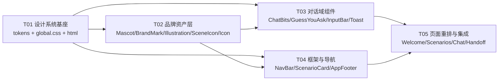

# 吉小农 H5 视觉重构 · 设计系统与任务分解

> 架构师：高见远（Gao） · 目标：去除「AI 生成模板感」，做出克制、有品位、像真人设计的移动端校园助手
> 范围：`jlau-ai-assistant/web/`（Vite + React + TS + 自定义 CSS 变量，无 Tailwind）
> 原则：最小变更 —— 优先「保留 token key 名 + 只换值」，避免全量重写 CSS 选择器

---

## 1. 现状审计：AI 模板感问题清单

### 1.1 致命项（一眼假）

| # | 文件 | 现象 | 为什么显「AI」 |
|---|------|------|----------------|
| A1 | `components/NavBar.tsx` `StatusBar` + `global.css:134-155` | 硬编码假 iOS 状态栏：`9:41` + 信号格 SVG + 电池 SVG | H5 上方已有浏览器/微信自己的状态栏 → **双状态栏**。这是 Figma 模板直接搬运的最强信号，真人设计师绝不会留 |
| A2 | `design-tokens.json:24` | 主色 = 微信绿 `#07C160`（HSL 152°/93%/39%，饱和度拉满） | 「默认味饱和绿」。且它是**微信的**品牌色，不是吉林农大的 |
| A3 | `design-tokens.json:64-110` | 定义了 **9 个渐变** token，`global.css` 中被引用 20+ 处：顶栏、头像、气泡、按钮、name-chip、badge、卡片、pill、图标底 | 「凡是能上渐变的地方都上渐变」是 AI 生成 CSS 的第一签名 |
| A4 | `global.css` 全局 | `backdrop-filter: blur() saturate()` 出现 **7 处**（source-chip / guess-card / scenario-card / intro-card / info-note / feature-row / input-bar） | 毛玻璃滥用 → 移动端浑浊 + 掉帧。真人设计只在 1 处（悬浮层）用 |
| A5 | `global.css` 全局 | 阴影几乎全是彩色 glow：`0 6px 16px color-mix(accent 36%)`，且叠 `inset 0 1px 0 rgba(255,255,255,.42)` + `inset 0 -4px 10px rgba(10,58,30,.18)` | 彩色发光阴影 + 双层 inset 拟物高光 = 2013 年拟物残留混搭扁平，廉价感来源 |

### 1.2 视觉体系失序

| # | 文件 | 现象 |
|---|------|------|
| B1 | `global.css:101-124` | 顶栏整条三色渐变（薄荷→微信绿→深森林）+ `::after` 白色高光球 + 标题 `text-shadow`。满色渐变顶栏是移动端模板最典型骨架 |
| B2 | `global.css:70-76, 1152-1219, 1241-1249, 1300-1317` | 装饰层堆叠 5 层：`app-shell::before` 环境双 radial + 2 个 orb + 3 片 leaf + `welcome-halo` 无限脉冲 + `welcome-spark` 浮动。层层柔光 = 廉价 |
| B3 | `design-tokens.json:129-140` | 字号阶梯 15/16/17/18 四连档，肉眼无差别。`.nav-title` 和 `.scenario-title` 都用 `xl`(18) → **层级弱** |
| B4 | `global.css` 全局 | `line-height` 散落 6 种（1.45/1.5/1.55/1.6/1.7/1.8），`letter-spacing` 散落 8 种（-0.02 ~ 0.06em），全部硬编码无 token |
| B5 | `global.css` 全局 | 间距大量绕过 spacing token：硬写 `10px 14px` `3px 10px` `5px 11px` `6px 12px` `13px` `7px` `46px` `58px` `106px`。**4/8 栅格名存实亡** |
| B6 | `global.css` 全局 | 圆角同样绕过 token：硬写 `9px/12px/14px/16px/36px/46px/58px/8px`。气泡用 `--radius-2xl`(28px) 过圆，再挂 8px「小尾巴」 |
| B7 | `global.css:1559-1571` | 4 张场景卡的 `--card-tint` 全是绿系派生（accent / accent-2 / accent-3 / mix），顶部 4px 彩条**区分度≈0**，形同虚设 |
| B8 | `global.css:1573-1603` | 深色模式靠 `.dark .xxx { box-shadow: none }` 打了 12 个补丁 —— 反证浅色阴影本来就过重 |

### 1.3 内容与个性

| # | 文件 | 现象 |
|---|------|------|
| C1 | `components/Icon.tsx` | 注册 22 枚 lucide stock 图标，其中 `Search` 完全未使用（死代码）；`Sparkles`（✨）用了 2 处 —— **Sparkles 是 AI 生成物的签名图标** |
| C2 | `components/ChatBits.tsx:7` / `WelcomePage.tsx:39` | 头像 = 汉字「吉」/「我」放在渐变方块里。**零品牌形象**，纯占位 |
| C3 | `components/GuessYouAsk.tsx:40,60` | `guess-badge` = `text.slice(0,1)` 取问句首字塞进绿色圆角方块。**无信息量的视觉噪音** |
| C4 | `pages/WelcomePage.tsx` | 全屏 `align-items:center`：居中头像→居中标题→居中副标→3 张等高浮起卡→大圆角按钮→footer。**AI 落地页标准骨架** |
| C5 | `pages/ScenariosPage.tsx` + `global.css:766-786` | 2×2 等尺寸网格（`min-height:176px`），四卡完全等重，**无主次、无节奏** |
| C6 | `pages/ChatPage.tsx:298` | `m.sources?.map(...)` 让每条来源独占一行 pill，多来源时纵向堆成一列，撑破气泡节奏 |
| C7 | `pages/ChatPage.tsx:304,310,314,321,334` | **5 处内联 `style={{marginTop:...}}`**，且复用 `.screen-sub` 渲染兜底提示 —— 语义错配 |
| C8 | `index.html:8` | `theme-color="#07C160"` 硬编码微信绿，与 token 脱钩 |

---

## 2. 刷新后的设计系统

### 2.0 设计意图

> **「田垄与纸」** —— 去饱和的农大绿 + 温暖纸质中性底 + 一抹麦金。
> 绿色从「铺满」退回到「点到」：绿只出现在主操作、品牌标识、用户气泡；其余交给纸白与墨黑。
> 用**留白节奏 + 发丝分隔线 + 分区标签**制造层次，替代「浮起卡片堆」。

### 2.1 颜色 Token（保留现有 key 名，仅换值 → CSS 选择器零改名）

#### Light（`color`）

| Token key | CSS 变量 | 用途 | Hex |
|---|---|---|---|
| `bg` | `--bg` | 页面纸底（暖米白） | `#FAF9F5` |
| `surface` | `--surface` | 卡片 / AI 气泡 | `#FFFFFF` |
| `surfaceWarm` | `--surface-warm` | 输入底 / 分组底 | `#F2F1EB` |
| `surfaceTint` | `--surface-tint` | 品牌极淡底（图标井） | `#EDF2ED` |
| `glass` | `--glass` | **停用毛玻璃**，退化为实色 | `#FFFFFF` |
| `glassBorder` | `--glass-border` | 同上，退化为普通边框 | `#E4E2D9` |
| `fg` | `--fg` | 正文主色（墨） | `#1B1F1C` |
| `fg2` | `--fg-2` | 次级文字 | `#4C534E` |
| `muted` | `--muted` | 三级 / 说明文字（AA 4.8:1） | `#69716C` |
| `meta` | `--meta` | 占位符 / 装饰性 meta | `#9AA19B` |
| `border` | `--border` | 默认边框 | `#E4E2D9` |
| `borderSoft` | `--border-soft` | 发丝分隔线 | `#EFEDE5` |
| `accent` | `--accent` | **主色·农大绿**（白字 6.05:1 AA） | `#3D6B51` |
| `accentHover` | `--accent-hover` | 主色 hover | `#35604A` |
| `accentActive` | `--accent-active` | 主色按下 | `#2E5440` |
| `accentOn` | `--accent-on` | 主色上的文字 | `#FFFFFF` |
| `accent2` | `--accent-2` ⚠️ | 淡绿·图形 / 分隔 / 次强调 | `#79A187` |
| `accent3` | `--accent-3` ⚠️ | 深绿·标题 / 链接 / 品牌字 | `#2E5440` |
| `grain` 🆕 | `--grain` | **麦金强调**（图形，破满屏绿） | `#B58234` |
| `grainDeep` 🆕 | `--grain-deep` | 麦金文字级（AA） | `#8C6220` |
| `grainSoft` 🆕 | `--grain-soft` | 麦金浅底 | `#F4EBD9` |
| `bubbleUser` | `--bubble-user` | **用户气泡：品牌绿实色** | `#3D6B51` |
| `bubbleUserFg` 🆕 | `--bubble-user-fg` | 用户气泡文字 | `#FFFFFF` |
| `bubbleAi` | `--bubble-ai` | **AI 气泡：纸白 + 发丝边** | `#FFFFFF` |
| `bubbleAiFg` | `--bubble-ai-fg` | AI 气泡文字 | `#1B1F1C` |
| `success` | `--success` | 成功（克制绿） | `#3F7A55` |
| `warn` | `--warn` | 警告（= 麦金，复用） | `#B58234` |
| `danger` | `--danger` | 错误（砖红，非荧光红） | `#A8453C` |
| `dangerSoft` 🆕 | `--danger-soft` | 错误浅底 | `#F7EAE8` |
| `link` | `--link` | 链接（深绿 + 下划线，非蓝） | `#2E5440` |

#### Dark（`colorDark`）

| CSS 变量 | Hex | | CSS 变量 | Hex |
|---|---|---|---|---|
| `--bg` | `#131512` | | `--accent` | `#5E9C78` |
| `--surface` | `#1B1E19` | | `--accent-hover` | `#6BAA85` |
| `--surface-warm` | `#232720` | | `--accent-active` | `#4A8263` |
| `--surface-tint` | `#1C2A22` | | `--accent-on` | `#0F1A14` |
| `--glass` | `#1B1E19` | | `--accent-2` | `#7CB894` |
| `--glass-border` | `#2C302A` | | `--accent-3` | `#A8CDB6` |
| `--fg` | `#E7E9E3` | | `--grain` | `#D2A055` |
| `--fg-2` | `#B0B5AE` | | `--grain-deep` | `#E0B570` |
| `--muted` | `#848A82` | | `--grain-soft` | `#2E2617` |
| `--meta` | `#616760` | | `--bubble-user` | `#33604A` |
| `--border` | `#2C302A` | | `--bubble-user-fg` | `#EAF3ED` |
| `--border-soft` | `#242822` | | `--bubble-ai` | `#1B1E19` |
| `--success` | `#5E9C78` | | `--bubble-ai-fg` | `#E7E9E3` |
| `--warn` | `#D2A055` | | `--danger` | `#D9736A` |
| `--link` | `#A8CDB6` | | `--danger-soft` | `#2A1B19` |

#### 用色配额（硬约束，防「满屏绿」回归）

| 规则 | 上限 |
|---|---|
| 单屏内 `--accent` 实色填充块 | **≤ 2 处**（主 CTA + 用户气泡） |
| 单屏内 `--grain` 出现 | **≤ 1 处** |
| 渐变使用 | **仅 1 处**（Welcome 首屏背景极淡光晕，可选，可为 0） |
| `backdrop-filter` | **0 处**（全部移除） |
| 彩色阴影（`color-mix(accent...)` 作 shadow） | **0 处** |
| `inset` 白高光阴影 | **0 处** |

### 2.2 字体阶梯（`font.size` 重排 + 新增 `leading` / `tracking` 组）

系统安全字体栈保持不变（不引 Web 字体，见「待确认」）。

| 角色 | Token key | CSS 变量 | 字号 | 行高 | 字距 | 字重 | 用途 |
|---|---|---|---|---|---|---|---|
| Display | `4xl` | `--text-4xl` | 30px | 1.25 | -0.02em | 700 | Welcome 主标题（全站唯一） |
| Title-1 | `3xl` | `--text-3xl` | 26px | 1.28 | -0.02em | 700 | 页面主标题 |
| Title-2 | `2xl` | `--text-2xl` | 22px | 1.35 | -0.015em | 700 | 分区大标题 |
| Title-3 | `xl` | `--text-xl` | 20px | 1.35 | -0.01em | 600 | 卡片标题 / 场景名 |
| Title-4 | `lg` | `--text-lg` | 18px | 1.4 | -0.01em | 600 | 顶栏标题 / 主推卡标题 |
| Subtitle | `md` | `--text-md` | 16px | 1.5 | 0 | 600 | 列表项标题 / 联系人名 |
| Body | `base` | `--text-base` | 15px | 1.65 | 0 | 400 | 气泡正文 / 输入框 |
| Callout | `sm` | `--text-sm` | 13px | 1.5 | 0 | 400 | 说明 / 描述 / 次级按钮 |
| Micro | `xs` | `--text-xs` | 11px | 1.4 | 0.02em | 500 | 时间戳 / 芯片 |
| Label | `label` 🆕 | `--text-label` | 12px | 1.35 | **0.08em** | 600 | 分区标签（大写感，制造节奏） |
| ~~`5xl`~~ | — | — | **删除** | | | | 仅服务旧「吉」字头像，Mascot 替换后作废 |

**新增 `leading` 组** → `--leading-*`：`tight 1.25` / `snug 1.35` / `normal 1.5` / `relaxed 1.65` / `loose 1.8`
**新增 `tracking` 组** → `--tracking-*`：`tighter -0.02em` / `tight -0.01em` / `normal 0` / `wide 0.02em` / `wider 0.08em`

> 硬规则：`global.css` 中**禁止再出现裸 `line-height:` / `letter-spacing:` 数值**，一律引用上述变量。

`font.weight` 保持不变：`read 400` / `emphasize 500` / `announce 600` / `strong 700`。

### 2.3 间距 / 圆角 / 阴影 Token

#### 间距（严格 4 栅格）

| Token key | CSS 变量 | 值 | 语义 |
|---|---|---|---|
| `1`–`6` | `--space-1..6` | 4 / 8 / 12 / 16 / 20 / 24 | 不变 |
| `7` 🆕 | `--space-7` | 28px | 分区间距 |
| `8` / `10` / `12` | `--space-8/10/12` | 32 / 40 / 48 | 不变 |
| `14` 🆕 | `--space-14` | 56px | 首屏大留白 |
| `gutter` 🆕 | `--space-gutter` | **20px** | 页面左右安全边距（全站唯一值） |
| `section` 🆕 | `--space-section` | **28px** | 相邻内容分区的垂直间距 |

> 硬规则：`global.css` 中禁止出现 4 的非倍数（`3px` / `5px` / `7px` / `9px` / `10px` / `11px` / `13px` / `14px` 等），仅 `1px` 发丝线例外。

#### 圆角（收敛）

| Token key | CSS 变量 | 旧值 | **新值** | 用途 |
|---|---|---|---|---|
| `xs` 🆕 | `--radius-xs` | — | 6px | 内联 code / 微标签 |
| `sm` | `--radius-sm` | 10 | **8px** | 图标按钮 / 小控件 |
| `md` | `--radius-md` | 14 | **12px** | 输入框 / note / toast |
| `lg` | `--radius-lg` | 18 | **16px** | 卡片 / 联系人块 |
| `bubble` 🆕 | `--radius-bubble` | — | 18px | 聊天气泡（专用） |
| `xl` | `--radius-xl` | 24 | **20px** | 大卡片 / 主推横幅 |
| `2xl` | `--radius-2xl` | 28 | **22px** | 极少用（Mascot 容器） |
| `pill` | `--radius-pill` | 9999 | 9999px | 仅 CTA 按钮与芯片 |

> 硬规则：气泡不再使用「大圆角 + 8px 小尾巴」的对角写法；统一 `--radius-bubble` 四角，仅**贴边角**降到 `--radius-sm`。

#### 阴影（全中性，去彩色 / 去 inset 高光）

| Token key | CSS 变量 | 值（Light） |
|---|---|---|
| `flat` | `--elev-flat` | `none` |
| `ring` | `--elev-ring` | `0 0 0 1px var(--border)` |
| `soft` | `--elev-soft` | `0 1px 2px rgba(27,31,28,0.05)` |
| `raised` | `--elev-raised` | `0 1px 2px rgba(27,31,28,0.04), 0 2px 6px rgba(27,31,28,0.06)` |
| `pop` | `--elev-pop` | `0 2px 4px rgba(27,31,28,0.04), 0 8px 20px rgba(27,31,28,0.08)` |
| `float` | `--elev-float` | `0 4px 8px rgba(27,31,28,0.05), 0 16px 32px rgba(27,31,28,0.10)` |

**Dark 覆盖**（`shadow` 组无 dark 通道，在 `global.css` 的 `.dark {}` 里一次性重写 5 行，**不再逐选择器 `box-shadow:none` 打补丁**）：

| 变量 | Dark 值 |
|---|---|
| `--elev-soft` | `0 1px 2px rgba(0,0,0,0.30)` |
| `--elev-raised` | `0 1px 3px rgba(0,0,0,0.34)` |
| `--elev-pop` | `0 4px 14px rgba(0,0,0,0.40)` |
| `--elev-float` | `0 10px 28px rgba(0,0,0,0.48)` |
| `--elev-ring` | `0 0 0 1px var(--border)` |

#### 焦点环

`--focus-ring: 0 0 0 3px color-mix(in srgb, var(--accent) 32%, transparent)`（由 tokens.ts 派生，保持现有机制）。
顶栏改为中性表面后，`.app-header` 内的白色焦点环特例**可删除**。

### 2.4 动效规范

| 触发点 | 属性 | 时长 | 缓动 |
|---|---|---|---|
| 按钮 / 卡片 **按压** | `transform: scale(0.97)` | `--motion-instant` 100ms 🆕 | `--ease-standard` |
| hover 抬起（`@media (hover:hover)` 内） | `translateY(-1px)` + `soft→raised` | `--motion-fast` 150ms | `--ease-standard` |
| 输入框 **聚焦** | `border-color` + 3px ring | 150ms | `--ease-standard` |
| 消息 **入场** | `opacity 0→1` + `translateY(8px→0)` | `--motion-base` 220ms | `--ease-out` |
| 列表 **stagger** | delay `0 / 40 / 80 / 120ms` | 最多 **4 项**，超出不再延迟 | — |
| 页面 / 空状态入场 | `opacity` + `translateY(10px→0)` | `--motion-slow` **300ms**（340→300） | `--ease-out` |
| **打字指示** | 三点 `opacity 0.3↔1` 呼吸，**无 Y 位移** | 1.4s loop | `--ease-standard` |
| Toast 出现 | `opacity` + `translateY(6px→0)` | 220ms | `--ease-out` |

**Token 变更**：新增 `motion.instant = 100ms`；`motion.slow` 340 → **300ms**；`ease` / `easeOut` 值保持不变。

**禁止清单**：
- ❌ 回弹 / overshoot（`scale > 1.02`、bounce 曲线）
- ❌ 无限循环的光晕脉冲（`jlau-pulse`）、浮动旋转（`jlau-spark-float`）→ **删除这两个 keyframes**
- ❌ `backdrop-filter` 参与过渡
- ❌ 打字点的 `translateY` 跳动（改纯透明度呼吸）
- ✅ `prefers-reduced-motion` 兜底段落保留（已有，`global.css:1545`）

### 2.5 品牌个性：吉小农母题

**母题**：破土麦苗 —— 一颗圆头（子叶）+ 两片叶 + 一道土线。纯几何 SVG，**单色 `currentColor` + 最多 1 个 tint**，不用渐变、不用描边噪点。

| 组件 | 用途 | 规格 |
|---|---|---|
| `<Mascot expression size />` | 吉祥物本体 | 三态 `idle` / `thinking`（闭眼+三点） / `happy`；尺寸 `sm 28` / `md 40` / `lg 96`。用于聊天头像、Welcome 主视觉、空状态 |
| `<BrandMark size />` | 极简叶片标（无脸） | 顶栏左侧、`.name-chip` 前缀、favicon 源。仅一条路径 |
| `<Illustration name />` | 线性插画 | `emptyChat` / `handoff` / `error`。线宽 1.5，主色 `--accent-2`，**1 个 `--grain` 点缀**，尺寸 ≤ 160px |
| `<SceneIcon name />` | 4 枚自绘场景图标 | `baodao` / `xuanke` / `kaoyan` / `shenghuo`。替换 lucide 的 `MapPin/BookOpen/GraduationCap/Coffee` —— 这是用户第一眼看到、最易显 stock 的位置 |

**lucide 保留范围**（仅功能性 chrome，`strokeWidth` 统一 **1.75**）：
`ChevronLeft` `MoreHorizontal` `Send` `Mic` `Phone` `Headset` `ThumbsUp` `Flag` `AlertCircle` `CheckCircle` `LoaderCircle` `Sun` `Moon` `ArrowRight` `HelpCircle` `BookOpen`（来源芯片）

**删除**：`Sparkles`（AI 签名图标）、`Coffee` `GraduationCap` `MapPin`（→ SceneIcon）、`MessageCircle`、`Search`（死代码）。

---

## 3. 文件清单（相对 `web/`）

| # | 文件 | 动作 | 一句话意图 |
|---|---|---|---|
| 1 | `../design-system/design-tokens.json` | **编辑** | 唯一事实源换血：农大绿色板 + 暖中性 + 麦金；字号阶梯重排 + 新增 leading/tracking/label；间距补 7/14/gutter/section；圆角收敛；阴影全中性；渐变降级为实色（安全网） |
| 2 | `src/lib/tokens.ts` | **编辑** | 注入新增的 `leading` / `tracking` 组与 `motion.instant`；**保留 `kebab()` 原样**（`accent2→--accent-2` 不可回退） |
| 3 | `src/styles/global.css` | **编辑（大改）** | 删毛玻璃/彩色glow/inset高光/装饰层；顶栏改中性；建立 `.btn` 体系与 `.section` 分区节奏；落地新类名契约 |
| 4 | `index.html` | **编辑** | `theme-color` 改 `#3D6B51`；内联 SVG favicon（叶片 mark）；防闪白底色 |
| 5 | `src/components/Mascot.tsx` | **新增** | 吉小农 SVG 吉祥物，3 表情 × 3 尺寸，单色 |
| 6 | `src/components/BrandMark.tsx` | **新增** | 极简叶片标（顶栏 / name-chip / favicon） |
| 7 | `src/components/Illustration.tsx` | **新增** | 3 幅线性插画：emptyChat / handoff / error |
| 8 | `src/components/SceneIcon.tsx` | **新增** | 4 枚自绘场景图标，替换 lucide stock |
| 9 | `src/components/Icon.tsx` | **编辑** | 精简注册表（删 6 枚）；`strokeWidth` 默认 1.75 |
| 10 | `src/components/ChatBits.tsx` | **编辑** | Avatar 用 `<Mascot>`；`.name-chip` 降级为纯文字 label；SourceChip 改「来源折叠区块」；FeedbackBar 走 `.btn-ghost` |
| 11 | `src/components/GuessYouAsk.tsx` | **编辑** | **删除 `guess-badge` 汉字方块**；2 列卡片网格 → 单列 hairline 行列表 |
| 12 | `src/components/InputBar.tsx` | **编辑** | 去毛玻璃；发送键实色 + `scale(0.97)` 按压；Mic 降噪为 ghost |
| 13 | `src/components/Toast.tsx` | **编辑** | 去渐变，中性 surface + 左侧 2px success 竖条 |
| 14 | `src/components/NavBar.tsx` | **编辑** | **删除假 iOS StatusBar**（9:41/信号/电池）；顶栏改中性表面 + 发丝底线；左侧加 BrandMark |
| 15 | `src/components/ScenarioCard.tsx` | **编辑** | 拆为 `variant="banner" \| "row"`：主推横幅 + 紧凑行 |
| 16 | `src/components/AppFooter.tsx` | **编辑** | 对齐 `--text-xs` / `--meta`，收紧上间距 |
| 17 | `src/pages/WelcomePage.tsx` | **编辑** | 反「整屏居中」：左对齐叙事式；Mascot 主视觉；feature 卡 → 分隔行；**删装饰层**；sticky 底部 CTA |
| 18 | `src/pages/ScenariosPage.tsx` | **编辑** | 2×2 等重网格 → 1 主推横幅 + 3 紧凑行；加分区标签 |
| 19 | `src/pages/ChatPage.tsx` | **编辑** | 空状态用 Illustration；**清除 5 处内联 style**；来源折叠；兜底提示改 `.fallback-note` |
| 20 | `src/pages/HandoffPage.tsx` | **编辑** | 表单分区化（`.section-label` + 发丝分隔）；联系人行去浮起；插画头图 |

> `src/lib/api.ts` / `src/types/*` / `src/lib/theme.ts` / `MarkdownText.tsx` / `App.tsx` / `main.tsx` **不动**（纯视觉重构，零业务逻辑变更）。

---

## 4. 有序任务列表

| Task | 名称 | 文件 | 依赖 | 优先级 |
|---|---|---|---|---|
| **T01** | **设计系统基座** | `design-system/design-tokens.json`、`src/lib/tokens.ts`、`src/styles/global.css`、`index.html` | — | P0 |
| **T02** | **品牌资产层** | `src/components/Mascot.tsx`(新)、`BrandMark.tsx`(新)、`Illustration.tsx`(新)、`SceneIcon.tsx`(新)、`Icon.tsx` | T01（仅需 token 名，可与 T01 并行开工） | P0 |
| **T03** | **对话域组件** | `ChatBits.tsx`、`GuessYouAsk.tsx`、`InputBar.tsx`、`Toast.tsx` | T01, T02 | P0 |
| **T04** | **框架与导航组件** | `NavBar.tsx`、`ScenarioCard.tsx`、`AppFooter.tsx` | T01, T02 | P0 |
| **T05** | **页面重排与集成** | `WelcomePage.tsx`、`ScenariosPage.tsx`、`ChatPage.tsx`、`HandoffPage.tsx` | T03, T04 | P0 |

### T01 详解（最关键，必须一次做对）

1. **先改 `design-tokens.json`**：按 §2.1–2.4 全量替换 `color` / `colorDark` / `font.size` / `radius` / `shadow` / `motion`，新增 `leading` / `tracking` / `spacing.7/14/gutter/section` / `font.size.label`，删除 `font.size.5xl`。
2. **`gradient` 组降级为安全网**（不删 key，避免 CSS 变量失效导致白屏）：
   | key | 新值 |
   |---|---|
   | `brand` | `var(--surface)` |
   | `primary` / `cta` | `var(--accent)` |
   | `primaryDeep` | `var(--accent-3)` |
   | `avatar` | `var(--surface-tint)` |
   | `bubbleAi` | `var(--bubble-ai)` |
   | `glass` | `var(--surface)` |
   | `glow` | `radial-gradient(circle, color-mix(in srgb, var(--accent) 6%, transparent) 0%, transparent 65%)` |
   | `ambient` | `none` |

   同时删除 `gradientDark` 中的 `glass` / `bubbleAi` / `ambient` 三项。
   → 效果：**即使 CSS 还没改完，视觉也立刻收敛且不会崩**，可增量验证。
3. **再改 `tokens.ts`**：新增 `leading` / `tracking` 注入 + `motion.instant`。`kebab()` 一个字符都不许动。
4. **最后重构 `global.css`**：按 §5 类名契约落地。允许提前写入 T03–T05 才用到的新类名（暂时是 dead CSS，可接受）。
5. `index.html`：`theme-color` → `#3D6B51`，加 `<link rel="icon" href="data:image/svg+xml,...">` 叶片标。

### 任务依赖图

---

## 5. 共享知识 / 跨文件约定

### 5.1 ⚠️ 不可回归的历史修复点

| 事项 | 约束 |
|---|---|
| **`kebab()` 数字边界规则** | `tokens.ts:42-48` 的 `.replace(/([a-z])([0-9])/g, '$1-$2')` **必须保留**。`accent2 → --accent-2`、`accent3 → --accent-3`、`fg2 → --fg-2`、`bubbleUserFg → --bubble-user-fg`。**任何 CSS 里写 `--accent2` 都是 bug**。新增 token key 也必须遵守此推导，不得凭感觉写变量名 |
| 深色模式 | 走 `<html>.dark` class 级联（`theme.ts`），**禁止**在组件里手写主题判断 |
| Markdown 渲染 | `Bubble` 仅对 `role==='assistant' && status!=='error' && typeof children==='string'` 走 `MarkdownText`（消灭 `**星号**`），此逻辑不得改动 |
| SourceChip 坏链接 | `url` 非 `^https?://` 时必须渲染不可点击的静态标签，**不得**退回 `<a href="">` |
| 会话持久化 | `ChatPage` 的 250ms 防抖落盘 + 卸载立即落盘逻辑**零改动**（纯视觉任务） |
| 颜色硬编码 | `global.css` 禁裸 hex（仅 `#fff` / `#000` 例外，且新方案下应为 0 处） |

### 5.2 类名契约（T01 定义，T02–T05 消费）

| 旧类名 | 新类名 | 说明 |
|---|---|---|
| `.status-bar` `.sb-time` `.sb-signal` | **删除** | 假 iOS 状态栏，整块移除 |
| `.welcome-decor` `.orb` `.leaf` `.welcome-halo` `.welcome-spark` | **删除** | 装饰层清零 |
| `.app-shell::before`（ambient） | **删除** | |
| `.screen-pad` | `.page-pad` | 左右 `--space-gutter` |
| `.scenario-grid` `.scenario-card` `.scenario-ico-wrap` `.status-pill` | `.scenario-stack` / `.scenario-banner` + `.scenario-row` / `.scene-ico` / `.scene-badge` | 1 主推 + 3 行 |
| `.guess-grid` `.guess-card` `.guess-badge` | `.guess-list` / `.guess-row` / **删 badge** | 单列行式 |
| `.feature-list` `.feature-row` `.feature-ico` | `.value-list` / `.value-row` / `.value-ico` | 去卡片，改发丝分隔 |
| `.welcome-avatar` | `.hero-mascot` | |
| `.enter-btn` `.cta-primary` `.text-btn` | **统一 `.btn` 体系** | `.btn` + 变体 `.btn-primary` / `.btn-quiet` / `.btn-ghost` + 尺寸 `.btn-sm` / `.btn-lg` / `.btn-block` |
| — | `.section` / `.section-label` 🆕 | 分区容器 + 12px/0.08em 分区标签，制造节奏 |
| — | `.divider` 🆕 | 1px `--border-soft` 发丝线 |
| — | `.sticky-cta` 🆕 | 底部固定 CTA 容器（含 `env(safe-area-inset-bottom)`） |
| — | `.fallback-note` 🆕 | 兜底提示专用（替代 ChatPage 里滥用的 `.screen-sub` + 内联 style） |
| — | `.source-fold` / `.source-fold-toggle` / `.source-list` 🆕 | 多来源折叠：1 条直显，≥2 条显示「来源 (n)」可展开 |
| `.name-chip` | 保留类名，**样式重写** | 渐变胶囊 → 纯文字 micro label（`--muted`），前缀 `<BrandMark size={12}>` |

### 5.3 品牌组件使用约定

| 场景 | 用法 |
|---|---|
| 聊天 AI 头像 | `<Mascot size="sm" expression="idle" />`；流式中切 `expression="thinking"` |
| 用户头像 | **不用 Mascot** —— 纯字母/汉字 + `--surface-warm` 底 + `--border` 环，保持弱化 |
| Welcome 主视觉 | `<Mascot size="lg" expression="happy" />`，**左对齐**放置，不居中、不加光晕 |
| 空状态 | `<Illustration name="emptyChat" />`，宽度 ≤ 160px，下方 callout 文案 |
| 顶栏 / name-chip | `<BrandMark />`，尺寸 20 / 12 |
| 场景卡 | `<SceneIcon name={scenarioId} />`，容器 `.scene-ico` 40×40，`--surface-tint` 底 |
| **上色方式** | 一律 `fill="currentColor"` / `stroke="currentColor"`，由父级 CSS 变量决定颜色；**SVG 内禁写 hex、禁写 `<linearGradient>`** |
| 无障碍 | 装饰性 `aria-hidden="true"`；承载语义时给 `role="img"` + `aria-label` |

### 5.4 布局节奏约定（反「居中卡片堆」）

1. **左对齐优先**：正文、标题、列表一律左对齐；仅按钮内文字与 Toast 居中。
2. **分区（Section）而非卡片**：相关内容用 `.section` + `.section-label` 分组，用 `--space-section` (28px) 隔开，用 `.divider` 发丝线切分 —— **不是每组套一张浮起卡**。
3. **卡片配额**：单屏浮起卡（带 `--elev-raised` 及以上）**≤ 1 张**；其余用「无阴影 + 发丝边」或「纯分隔行」。
4. **不等重**：场景页必须有 1 张主推（横幅，含插画）+ N 条紧凑行；禁止 2×2 全等网格。
5. **底部 CTA**：`.sticky-cta` 固定，不随内容滚动；上方留 `--space-6` 呼吸。

---

## 6. 待确认事项（需用户/PM 拍板）

| # | 事项 | 我的建议 | 影响 |
|---|---|---|---|
| **Q1** | **brandLock 变更**：`design-tokens.json:9` 记录 PM 已签署「微信绿 `#07C160` 锁定」。本方案将主色改为去饱和农大绿 `#3D6B51` | **建议改**。仍在绿色系内、未引入蓝，符合「no blue、不换色相」精神，只是降饱和 + 加深。但**字面上改动了 PM 签署项，需复签** | 🔴 阻塞级 —— 未确认则整个色板不能落地 |
| **Q2** | 引入**麦金 `#B58234`** 作二级强调色（brandLock 只授权绿色系） | **建议引入**。这是打破「满屏绿 = AI 味」的最有效一招，用量严格 ≤1 处/屏 | 🔴 与 Q1 同批复签 |
| **Q3** | **删除假 iOS 状态栏**（9:41 + 信号 + 电池） | **强烈建议删**。H5 上是双状态栏，是最大的「假」。但若这套 UI 还要用于**评审截图 / 汇报 PPT**，删后截图会失去「手机感」 | 🟡 需确认用途 |
| **Q4** | **用户气泡改为品牌绿实色 + 白字**（当前为中性灰 `#EDF0F2`） | **建议改**。左白右绿是当代成熟聊天 UI，左右层级立刻清晰 | 🟡 视觉变化最大的单点 |
| **Q5** | 吉祥物形象定位：**抽象几何麦苗**（我方案，纯 SVG，零成本、可换色、轻量）vs **拟人角色形象**（需专业插画，成本高、难做深色模式） | **建议抽象几何**。保持轻量 + 可 currentColor 换色 | 🟢 可默认推进 |
| **Q6** | 是否引入 Web 字体（Inter + Noto Sans SC 子集） | **建议不引入**。中文字体子集仍有数百 KB，H5 首屏代价高；系统栈（PingFang SC / 苹方 / 微软雅黑）在移动端已足够好，性格由**字重与字距层级**来做 | 🟢 可默认推进 |
| **Q7** | 场景卡「1 主推 + 3 行」的主推项选谁 | 建议 `baodao`（新生报到 —— 唯一确定已开通、也是新生最高频） | 🟢 可默认推进 |
| **Q8** | `InputBar` 的 `Mic` 语音按钮当前**无任何功能** | 建议**直接删除**（无功能的 stock 图标是 AI 味来源之一）；若产品后续要做则保留但置灰 | 🟢 倾向删除 |

---

## 7. 验收清单（交给 QA）

- [ ] 全站 `grep -c "backdrop-filter"` = **0**
- [ ] 全站无 `color-mix(... var(--accent) ...)` 出现在 `box-shadow` 中（彩色 glow = 0）
- [ ] 全站无 `inset 0 1px 0 rgba(255,255,255` （白高光 = 0）
- [ ] `global.css` 无裸 hex（`#fff`/`#000` 除外，理想为 0）
- [ ] `global.css` 无裸 `line-height:` / `letter-spacing:` 数值（全走 token）
- [ ] `global.css` 无 4 的非倍数 px（`1px` 边框除外）
- [ ] 无 `--accent2` / `--accent3` / `--fg2` 等**缺连字符**的变量引用（kebab 回归检查）
- [ ] 无 `9:41` / 电池 / 信号格 SVG 残留
- [ ] 无 `Sparkles` 图标残留
- [ ] 单屏 `--accent` 实色填充 ≤ 2 处、`--grain` ≤ 1 处、浮起卡 ≤ 1 张
- [ ] 明/暗双模全页面无对比度失效（正文 ≥ 4.5:1）
- [ ] `prefers-reduced-motion: reduce` 下无任何循环动画
- [ ] `npm run build`（含 `tsc --noEmit`）通过
