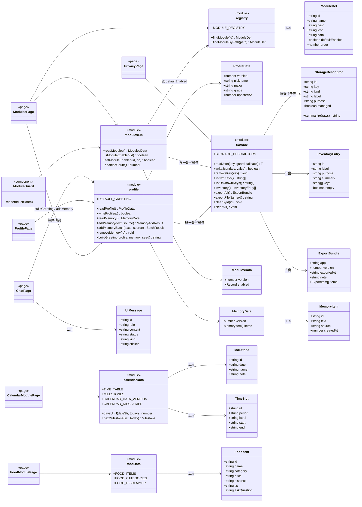
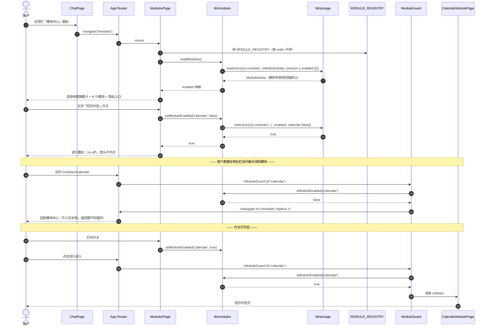
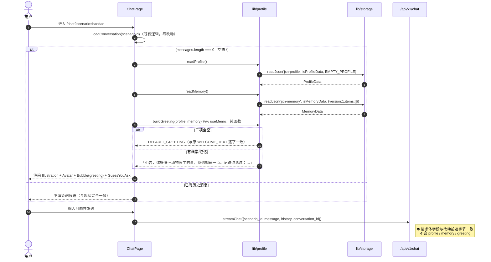
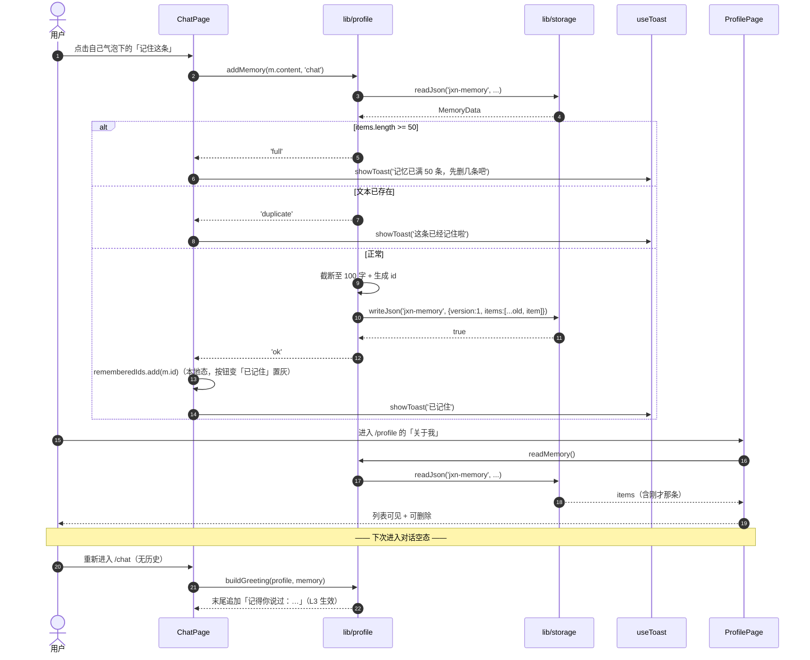
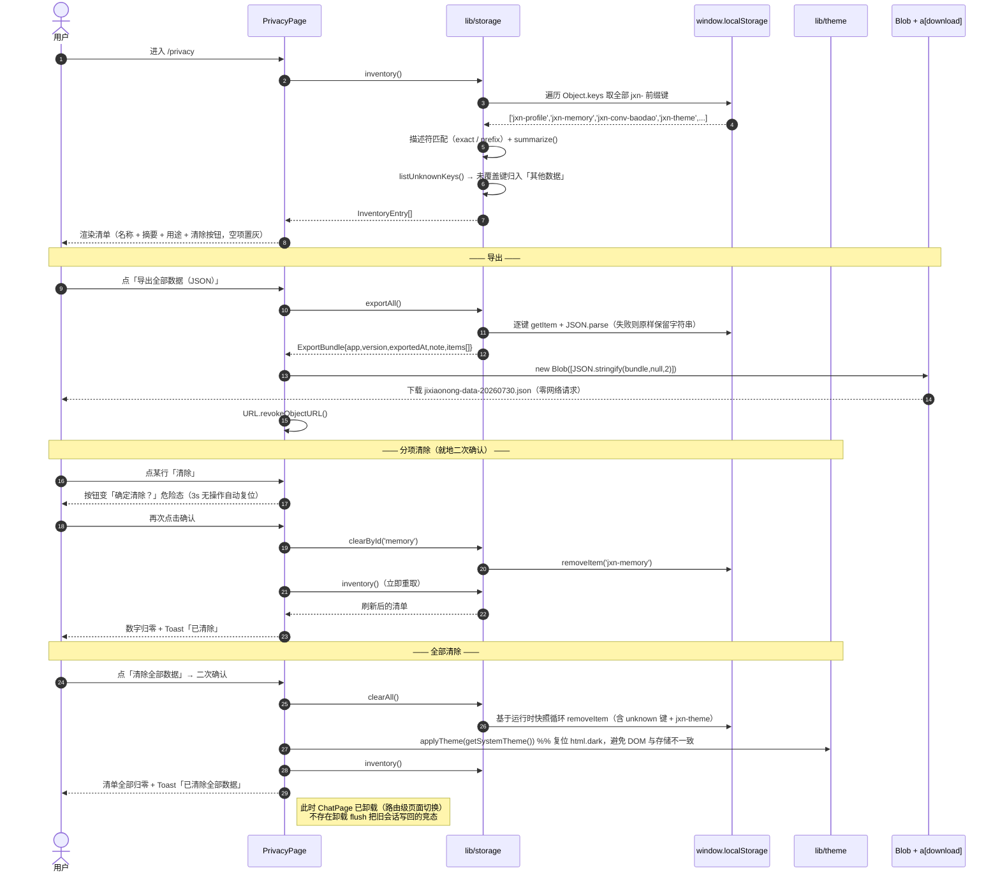
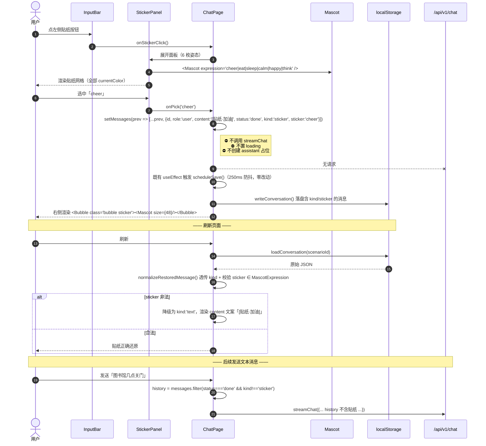
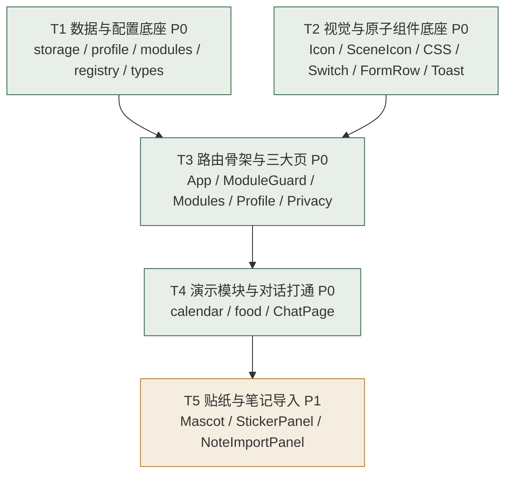

# 吉小农 × MaiBot 能力迁移 · 增量架构设计与任务分解

> 架构师：高见远 · 版本：v1.0 · 类型：**增量架构设计（前端单体）**
> 上游：`docs/maimai-capabilities-prd.md`（许清楚 v1.0）
> 范围：`jlau-ai-assistant/web/` —— **后端零改动**
> 下游：交付给工程师实现（5 个任务，见 §7）

---

## 0. 摘要（TL;DR）

| 维度 | 结论 |
|---|---|
| 路线 | **纯前端增量**，不新增依赖包、不新增接口、不改 `server/**` |
| 新增文件 | 18 个（P0 15 / P1 3） |
| 编辑文件 | 9 个（其中 3 个仅 P1 触碰） |
| 任务数 | **5 个**（T1–T4 = P0，T5 = P1），含 22 项子任务 |
| 三个关键决策 | ① **`lib/storage.ts` 单一出口 + 描述符注册表 + 未知键兜底扫描**；② 校历 = **前端占位静态数据 + 显式免责**；③ 模块系统 = **`MODULE_REGISTRY` 数据驱动 + `ModuleGuard` 路由守卫** |
| 架构层新增待明确项 | 5 项（A1–A5），**均不阻塞开工**，已给默认方案 |

---

## 1. 实现方案

### 1.1 为什么「零后端改动」可行

本次 4 项能力全部落在**「本地状态 + 本地渲染」**象限，没有任何一项需要服务端参与：

| 能力 | 数据来源 | 是否需要服务端 | 论证 |
|---|---|---|---|
| 学生档案 / 记忆 | 用户手输 → `localStorage` | ❌ | D1 已排除登录与跨端同步，数据天然单设备 |
| 个性化问候语 | 本地 profile + memory → 纯函数拼串 | ❌ | D5 明确**只改前端渲染文案**，`/api/v1/chat` 请求体逐字节不变 |
| 模块系统 | 前端注册表常量 + 本地开关 | ❌ | 模块是「前端路由 + 静态数据页」，不是服务端能力 |
| 校历 / 美食数据 | 前端静态 `data.ts` | ❌ | Q1/Q2 已决：本迭代不接实时源；美食的实时性需求由「问吉小农」按钮**引流回对话链路**（对话链路后端已能调高德 tool call） |
| 贴纸 | 自绘 SVG + 本地会话持久化 | ❌ | 贴纸消息**不发起** `/api/v1/chat` |
| 隐私中心 | 读写本机 `localStorage` + Blob 下载 | ❌ | 导出走 `Blob` + `<a download>`，零网络 |

**结论**：所有增量都是「浏览器内的状态与渲染」，不存在跨设备一致性、鉴权、并发写冲突等需要服务端仲裁的问题。因此 `server/**`、`web/src/lib/api.ts`、`web/src/types/api.ts` 全部保持零改动。

### 1.2 技术难点与对策

| # | 难点 | 对策 |
|---|---|---|
| N1 | **隐私中心「漏键」**——散落各处的 `localStorage.setItem` 导致清单/导出/清除遗漏，是本迭代最可能的结构性 bug | **描述符注册表 + 未知键扫描双保险**（§2.1）：所有键在 `STORAGE_DESCRIPTORS` 声明；同时 `listUnknownKeys()` 扫描运行时所有 `jxn-` 前缀键，未被描述符覆盖的**强制**在隐私中心「其他数据」分组显示。漏声明也不会漏显示 |
| N2 | **动态键** `jxn-conv-<scenarioId>`——场景数不固定，无法枚举成固定 key | 描述符引入 `kind: 'exact' \| 'prefix'`，前缀型描述符在运行时展开为实际键集合 |
| N3 | **外部写入者** `jxn-theme` 由既有 `lib/theme.ts` 写入，不经 storage.ts | 描述符标 `managed: false`（只读只清、不代写），避免为了统一出口去改动稳定的 `theme.ts` |
| N4 | **倒计时跨月/跨年** | 全量存 `YYYY-MM-DD` 绝对日期（不存 `MM-DD`），比较前双方归一到**本地零点**，用毫秒差 / 86400000 后 `Math.round`（§2.4） |
| N5 | **贴纸消息污染 LLM 上下文** | `send()` 构造 `history` 时过滤 `kind === 'sticker'`（§2.6）。这是 P1 的隐藏坑，必须在贴纸落地时同步处理 |
| N6 | **「注册表加一条就出现」的可验证性**（PRD-P0-04 AC③） | 列表渲染 100% 由 `MODULE_REGISTRY.map()` 驱动，页面无任何 `if (id === 'calendar')` 分支；路由表用**扁平查找表**而非渲染分支（§2.5 ADR-3） |
| N7 | **问候语随机导致每次 render 抖动 / 不可测** | `buildGreeting` 保持**纯函数**，随机源改为「**按天稳定的种子**」（`Math.floor(now/86400000)`），同一天同一句，可单测、无闪烁（§2.3） |

### 1.3 架构分层

```
┌─────────────────────────────────────────────────────────┐
│  pages/                 ModulesPage / ProfilePage /      │  视图层
│                         PrivacyPage / modules/*Page      │  （只调 lib，不碰 localStorage）
├─────────────────────────────────────────────────────────┤
│  components/            Switch / FormRow / PillRadio /   │  原子组件层
│                         DangerConfirmButton / ModuleGuard │
├─────────────────────────────────────────────────────────┤
│  lib/profile.ts         档案 + 记忆 + buildGreeting       │  领域层
│  lib/modules.ts         模块开关                          │
├─────────────────────────────────────────────────────────┤
│  lib/storage.ts         ★ 唯一 localStorage 出入口 ★      │  持久化层
├─────────────────────────────────────────────────────────┤
│  modules/registry.ts    模块注册表（纯数据）              │  配置层
│  modules/*/data.ts      校历 / 美食静态数据               │
└─────────────────────────────────────────────────────────┘
```

**依赖方向单向向下，禁止逆向 import。** 违反此约定即产生循环依赖（详见 §2.5 ADR-3 对循环的规避论证）。

---

## 2. 共享知识 / 跨文件约定

> 本节是给工程师的**契约**。T1 定义，T2–T5 消费。任何偏离都必须回到本节修订，不得在页面里就地发明。

### 2.1 ★ `jxn-*` 键清单与统一出口 `lib/storage.ts`

#### 键清单（唯一事实源）

| 描述符 id | key | kind | 人类可读名 | 用途说明（隐私中心展示） | 计数口径 | managed | 写入者 |
|---|---|---|---|---|---|---|---|
| `profile` | `jxn-profile` | exact | 学生档案 | 用于个性化问候 | 已填写 / 未填写 | ✅ | `lib/profile.ts` |
| `memory` | `jxn-memory` | exact | 关于我的记忆 | 用于问候语中的关怀提示 | `N 条` | ✅ | `lib/profile.ts` |
| `modules` | `jxn-modules` | exact | 模块开关 | 记住你开启了哪些模块 | `N 项` | ✅ | `lib/modules.ts` |
| `conversations` | `jxn-conv-` | **prefix** | 对话记录 | 刷新后还能看到聊天历史 | `N 个场景` | ✅（只清不写） | `pages/ChatPage.tsx`（既有，零改动） |
| `theme` | `jxn-theme` | exact | 主题偏好 | 记住你选的浅色/深色 | `深色` / `浅色` | ❌ | `lib/theme.ts`（既有，零改动） |
| — | 任意 `jxn-*` 未声明键 | 运行时扫描 | 其他数据 | 未登记的本地数据 | 字节数 | ❌ | — |

> **硬约束**：新增任何 `jxn-*` 键，**必须**同时在 `STORAGE_DESCRIPTORS` 追加一条描述符。CI/CR 检查点：`grep -rn "localStorage" web/src --include=*.ts --include=*.tsx` 的结果只允许出现在 `lib/storage.ts`、`lib/theme.ts`、`pages/ChatPage.tsx`（后两者为既有豁免）三个文件中。

#### `lib/storage.ts` 对外契约

```ts
// ---------- 描述符 ----------
export type StorageKind = 'exact' | 'prefix';

export interface StorageDescriptor {
  /** 稳定 id，隐私中心分项清除以此为准 */
  id: 'profile' | 'memory' | 'modules' | 'conversations' | 'theme';
  /** exact = 完整键名；prefix = 键名前缀 */
  key: string;
  kind: StorageKind;
  /** 隐私中心展示的中文名 */
  label: string;
  /** 一句话用途 */
  purpose: string;
  /** true = 本模块代写；false = 外部模块写入，此处只读/只清 */
  managed: boolean;
  /** 把原始字符串汇总成人类可读摘要，如 '3 条' / '已填写' / '深色' */
  summarize(raws: string[]): string;
}

export const STORAGE_DESCRIPTORS: readonly StorageDescriptor[];

// ---------- 低层读写（全部 try/catch，绝不抛出） ----------
export function readJson<T>(key: string, guard: (v: unknown) => v is T, fallback: T): T;
export function writeJson(key: string, value: unknown): boolean;   // 返回是否成功
export function removeKey(key: string): void;

// ---------- 枚举 / 审计 ----------
/** 运行时所有 jxn- 前缀键 */
export function listJxnKeys(): string[];
/** 未被任何描述符覆盖的 jxn- 键（漏声明兜底，隐私中心必须渲染） */
export function listUnknownKeys(): string[];

// ---------- 隐私中心三件套 ----------
export interface InventoryEntry {
  id: string;            // 描述符 id，或 'unknown:<key>'
  label: string;
  purpose: string;
  summary: string;       // '3 条' / '已填写' / '未填写'
  keys: string[];        // 实际命中的键（prefix 型可能多条）
  empty: boolean;        // true 时「清除」按钮置灰
}
export function inventory(): InventoryEntry[];

export interface ExportBundle {
  app: 'jixiaonong';
  version: 1;
  exportedAt: string;    // ISO 8601
  note: string;          // '本文件由你的浏览器本地导出，未上传任何服务器'
  items: Array<{ key: string; label: string; purpose: string; value: unknown }>;
}
export function exportAll(): ExportBundle;
export function exportFileName(d?: Date): string;  // 'jixiaonong-data-20260730.json'

export function clearById(id: string): void;   // 分项清除（prefix 型清全部命中键）
export function clearAll(): void;              // 清除全部 jxn-*（含 unknown 键）
```

**实现要点**
1. **所有**读写包 `try/catch`；隐私模式 / 配额溢出时静默降级（`readJson` 回 `fallback`，`writeJson` 回 `false`），**不得**白屏。
2. `readJson` 必须先 `JSON.parse` 再过 `guard` 类型守卫；解析失败或守卫不通过一律回 `fallback`（对应 PRD-P0-01 AC③：手改非法 JSON 页面仍正常）。
3. `clearAll()` **必须**基于 `listJxnKeys()` 的运行时快照循环删除，**不得**硬编码键数组——这是「漏键」的第二道闸。
4. `clearAll()` 会清掉 `jxn-theme`；调用方（PrivacyPage）**必须**随后调用 `applyTheme(getSystemTheme())` 复位 `<html>.dark`，否则 DOM 上的 class 与存储不一致。

### 2.2 本地数据结构（`web/src/types/local.ts`）

```ts
export const LOCAL_SCHEMA_VERSION = 1;

// ---- jxn-profile ----
export type Grade = '2026级' | '2025级' | '2024级' | '其他' | '';
export interface ProfileData {
  version: 1;
  nickname: string;   // ≤12 字，写入前截断
  major: string;      // ≤20 字，写入前截断
  grade: Grade;       // '' = 未选
  updatedAt: number;  // Date.now()
}
export const EMPTY_PROFILE: ProfileData;   // 全空且 updatedAt=0

// ---- jxn-memory ----
export type MemorySource = 'chat' | 'note' | 'manual';
export interface MemoryItem {
  id: string;            // `mem-${Date.now()}-${seq++}`
  text: string;          // ≤100 字，写入前截断
  source: MemorySource;
  createdAt: number;
}
export interface MemoryData {
  version: 1;
  items: MemoryItem[];   // 上限 MEMORY_MAX = 50
}
export const MEMORY_MAX = 50;
export const MEMORY_TEXT_MAX = 100;

// ---- jxn-modules ----
export interface ModulesData {
  version: 1;
  enabled: Record<string, boolean>;  // 缺 key 时回落 registry.defaultEnabled
}
```

> **`source` 说明**：PRD 只定义了 `'chat' | 'note'`。架构上补一个 `'manual'`（档案页手动添加），因为「手动添加」与「笔记导入」的来源语义不同，未来做来源筛选时不必再迁移数据。三种取值都被类型守卫接受；渲染层暂不区分展示。

### 2.3 `buildGreeting(profile, memory)` 降级链

```ts
/** 全空时的原文案，必须与改动前 ChatPage.tsx:13 的 WELCOME_TEXT 逐字一致 */
export const DEFAULT_GREETING =
  '同学你好，我是吉小农，吉林农业大学的一站式校园 AI 助手，随时问我～';

/**
 * 纯函数。seed 用于从记忆库稳定地挑一条（默认按天稳定，同一天同一句）。
 * 禁止在函数内读 localStorage、禁止调用 Date.now() 之外的副作用。
 */
export function buildGreeting(
  profile: ProfileData,
  memory: MemoryData,
  seed: number = Math.floor(Date.now() / 86_400_000),
): string;
```

**降级链（逐级叠加，任一级缺失即跳过该级）**

| 级 | 条件 | 产出片段 |
|---|---|---|
| L0 | `nickname` 与 `major` 与 `items` 全空 | **直接 return `DEFAULT_GREETING`**（整句原文案，不做拼接） |
| L1a | `nickname` 非空 | `「{nickname}，你好呀～」` |
| L1b | `nickname` 空但 L0 不成立 | `「同学你好，我是吉小农。」` |
| L2 | `major` 非空 | 追加 `「{major}的事，我也知道一点。」` |
| L3 | `items.length > 0` | 追加 `「记得你说过：{pick}。」`，`pick = items[seed % items.length].text`，展示前截断到 24 字并补 `…` |

**用例表**

| nickname | major | items | 输出 |
|---|---|---|---|
| 空 | 空 | 0 | `DEFAULT_GREETING`（逐字一致） |
| 小吉 | 空 | 0 | `小吉，你好呀～` |
| 小吉 | 动物医学 | 0 | `小吉，你好呀～动物医学的事，我也知道一点。` |
| 空 | 动物医学 | 0 | `同学你好，我是吉小农。动物医学的事，我也知道一点。` |
| 小吉 | 动物医学 | 3 | `小吉，你好呀～动物医学的事，我也知道一点。记得你说过：我不太能吃辣。` |
| 空 | 空 | 2 | `同学你好，我是吉小农。记得你说过：我住东区3号宿舍。` |

> ⚠️ **L3 文案形态待 PM 复核**（见 §8 A1）：PRD 文字写「从记忆库随机取 1 条」但示例给的是「今天也要好好吃饭呀～」这类固定关怀语。本设计取**回显记忆原文**——它能让用户**直接看见「它真的记住了」**，是这条需求的价值证明；固定关怀语池则与记忆无因果关系。两种形态均满足 PRD-P0-03 AC④。

**硬约束（工程师必须自检）**
- `buildGreeting` 的输出**只能**进入 JSX 渲染，**禁止**出现在 `streamChat({ ... })` 的任何参数中。
- `send()` 的 `history` 构造逻辑保持原样（只取 `role` / `content`），不得注入 profile/memory。

### 2.4 校历倒计时算法与边界

```ts
/** 把任意 Date 归一到本地零点（消除时分秒对天差的干扰） */
function atLocalMidnight(d: Date): Date;

/**
 * 返回目标日期距今天的天数：>0 未来 / 0 今天 / <0 已过。
 * dateStr 必须是 'YYYY-MM-DD'；非法格式返回 null（调用方过滤该条目）。
 */
export function daysUntil(dateStr: string, today?: Date): number | null;

/** 排序后第一条 daysUntil >= 0 的节点；全部已过返回 null */
export function nextMilestone(list: Milestone[], today?: Date): Milestone | null;
```

**实现规范**
1. 数据里**必须**存完整 `YYYY-MM-DD`（含年份），**禁止**只存 `MM-DD` —— 后者无法表达「12-25 期末」与「01-15 寒假」跨年的先后关系。UI 上再截取 `MM-DD` 显示。
2. 解析用 `new Date(y, m - 1, d)`（本地时区构造），**禁止** `new Date('2026-09-01')`（该写法按 UTC 解析，东八区会整体偏移一天）。
3. 天数 = `Math.round((target - base) / 86_400_000)`，两端均已归一到本地零点。

**边界用例表（QA 直接用）**

| # | 场景 | 期望 |
|---|---|---|
| B1 | 今天 12-31，节点 01-01（次年） | `1 天`，跨年正确 |
| B2 | 今天 09-30，节点 10-01 | `1 天`，跨月正确 |
| B3 | 节点日期 == 今天 | `daysUntil = 0`，横幅文案「**「{name}」就是今天**」，行高亮 |
| B4 | 全部节点已过 | `nextMilestone = null` → **不渲染** `CountdownBanner`，无任何行高亮，**不出现负数天数** |
| B5 | 某条 `date` 为 `'2026-13-45'` 等非法值 | 该条被过滤，不参与排序与渲染，页面不崩 |
| B6 | 列表本身为空数组 | 分区不渲染，不崩 |
| B7 | 23:59 → 00:01 跨天 | 无需实时刷新（页面级重新计算即可），不做定时器 |

### 2.5 模块注册表 `MODULE_REGISTRY`

```ts
import type { SceneId } from '../components/SceneIcon';

export interface ModuleDef {
  /** 稳定 id，作为 jxn-modules.enabled 的 key，一经发布不得改名 */
  id: string;
  name: string;          // '校历作息'
  desc: string;          // 一句话描述，≤14 字
  icon: SceneId;         // 走自绘 SceneIcon，禁用 lucide stock 图标
  path: string;          // '/modules/calendar'
  defaultEnabled: boolean;
  order: number;         // 升序排列，留 10 的步长便于插入
}

export const MODULE_REGISTRY: readonly ModuleDef[] = [
  { id: 'calendar', name: '校历作息', desc: '上课时间与学期节点', icon: 'calendar', path: '/modules/calendar', defaultEnabled: true, order: 10 },
  { id: 'food',     name: '周边美食', desc: '学校周边吃什么',     icon: 'food',     path: '/modules/food',     defaultEnabled: true, order: 20 },
];

export function findModule(id: string): ModuleDef | undefined;
export function findModuleByPath(path: string): ModuleDef | undefined;
```

```ts
// lib/modules.ts
export function readModules(): ModulesData;
export function isModuleEnabled(id: string): boolean;   // 缺 key 回落 registry.defaultEnabled
export function setModuleEnabled(id: string, on: boolean): boolean;
export function enabledCount(): number;
```

#### ADR-3：注册表驱动程度 与 循环依赖规避

| 方案 | 说明 | 取舍 |
|---|---|---|
| A（**采用**） | `registry.ts` **纯数据**（不 import 任何页面组件）；`App.tsx` 持一张扁平查找表 `MODULE_PAGES: Record<string, ComponentType>`，路由由 `MODULE_REGISTRY.map()` 生成 | 零循环依赖、类型安全、可读。新增模块 = 注册表 1 条 + 查找表 1 行，**列表与路由的渲染逻辑均无需改动**（满足 PRD-P0-04 AC③） |
| B | `registry.ts` 直接携带 `Component` 引用 | 产生环：`registry → page → ModuleGuard → lib/modules → registry`。**否决** |
| C | `import.meta.glob('../pages/modules/*.tsx')` 动态装配 | 完全零触点，但引入构建期魔法、丢失类型提示、模块名与文件名强耦合。**列为后备**，本迭代不采用 |

**路由生成（`App.tsx`）**

```tsx
const MODULE_PAGES: Record<string, ComponentType> = {
  calendar: CalendarModulePage,
  food: FoodModulePage,
};

{MODULE_REGISTRY.map((m) => {
  const Page = MODULE_PAGES[m.id];
  if (!Page) return null;                      // 假模块只上列表、不上路由，不崩
  return (
    <Route key={m.id} path={m.path}
           element={<ModuleGuard id={m.id}><Page /></ModuleGuard>} />
  );
})}
```

**`ModuleGuard` 契约**

```tsx
// 关闭 or 未知 id → <Navigate to="/modules" replace />
export function ModuleGuard({ id, children }: { id: string; children: ReactNode }): JSX.Element;
```
- 用 `replace`，避免用户点「返回」被弹回同一个被禁模块形成死循环。
- 判定只在**挂载时**读一次（`useState(() => isModuleEnabled(id))`），避免在 `/modules` 关开关的瞬间正在展示的页面被抽掉。

### 2.6 贴纸消息的持久化（P1）

```ts
// types/chat.ts（编辑）
export interface UIMessage {
  // ...既有字段全部保留
  /** 缺省 = 'text'，保证旧会话向后兼容 */
  kind?: 'text' | 'sticker';
  /** kind==='sticker' 时有效 */
  sticker?: MascotExpression;
}
```

**约定**
1. 贴纸消息 `role: 'user'`、`status: 'done'`、`kind: 'sticker'`、`sticker: 'cheer'`，`content` 写**可读回退文案** `'[贴纸·加油]'`——即使某天渲染层退化成纯文本也不会出现空气泡。
2. **复用既有会话落盘逻辑**：贴纸通过 `setMessages(prev => [...prev, stickerMsg])` 进入 `messages`，`ChatPage` 既有的 250ms 防抖 `useEffect` 与卸载 flush **自动**覆盖它——**不新增任何持久化代码**，PRD 硬约束「会话持久化逻辑零改动」得以严格满足。
3. **必须**扩展 `normalizeRestoredMessage()` 的白名单，透传 `kind` / `sticker`（校验 `sticker` 落在 `MascotExpression` 枚举内，否则降级为 `kind: 'text'`）。**这是唯一允许触碰的恢复逻辑**，与防抖落盘无关。
4. **必须**在 `send()` 构造 `history` 时过滤贴纸：
   ```ts
   const history = messages
     .filter((m) => m.status === 'done' && m.kind !== 'sticker')   // ← 新增条件
     .map((m) => ({ role: m.role, content: m.content }));
   ```
   否则 `[贴纸·加油]` 会作为用户发言进入 LLM 上下文。**注意这不违反 D5**：请求体的**字段结构**完全没变，改的是既有 `history` 数组的内容过滤。
5. 贴纸插入**不得**调用 `streamChat`、**不得**置 `loading`、**不得**创建 assistant 占位消息。

### 2.7 设计系统硬约束（继承 `design_refresh_system.md`，不得违反）

| 项 | 约束 |
|---|---|
| CSS 变量命名 | 遵守 `kebab()` 数字边界：`--accent-2` / `--accent-3` / `--fg-2` / `--grain-soft` / `--danger-soft` / `--surface-warm` / `--surface-tint`。**写 `--accent2` 就是 bug** |
| 禁令 | 裸 hex = 0、`backdrop-filter` = 0、`linearGradient` = 0、彩色 glow 阴影 = 0、inset 白高光 = 0 |
| 间距 | 严格 4 栅格；只用 `--space-*`，禁写 4 的非倍数 px（1px 边框除外） |
| 行高/字距 | 只用 `--leading-*` / `--tracking-*`，禁裸数值 |
| 用色配额 | 单屏 `--accent` 实色填充 ≤2 处、`--grain` ≤1 处、`--elev-raised` 及以上浮起卡 ≤1 张 |
| 图标 | 功能 chrome → `Icon`（lucide, strokeWidth 1.75）；品牌/模块标识 → `SceneIcon` / `Mascot`（自绘, `currentColor`） |
| 吉祥物 | **非拟人化**：禁眼睛/嘴/四肢/脸；表情靠茎弯曲、叶片开合、顶芽有无、抽象点；一律 `currentColor` |
| 主题 | 走 `<html>.dark` 级联，**禁止**组件内手写主题判断 |
| 动效 | 220ms `--ease-out` 上限；无回弹/overshoot/无限循环；`prefers-reduced-motion: reduce` 下关闭 |

**各页用色配额预算（工程师照此实现，QA 照此验收）**

| 页面 | `--accent` 实色（≤2） | `--grain`（≤1） | 浮起卡（≤1） |
|---|---|---|---|
| `/modules` | ① Switch 开态 ② 无 | 无 | `ProfileSummaryCard` |
| `/profile` | ① 年级 pill 选中 ② 保存 CTA | `.brand-rule` 麦金细线 | 无 |
| `/privacy` | ① 无（导出用 `.btn-quiet`） | 无 | 无（顶部说明用 `--surface-tint` + 发丝边，不带阴影） |
| `/modules/calendar` | ① 高亮节点行左侧 2px 竖条 | `CountdownBanner` 底色 `--grain-soft` | 无 |
| `/modules/food` | ① 选中筛选 pill | 无 | 无（卡片用 `--surface` + 发丝边） |

### 2.8 导出 JSON 契约（Q6 决策落地）

```json
{
  "app": "jixiaonong",
  "version": 1,
  "exportedAt": "2026-07-30T07:12:33.000Z",
  "note": "本文件由你的浏览器本地导出，未上传任何服务器。",
  "items": [
    { "key": "jxn-profile", "label": "学生档案",     "purpose": "用于个性化问候",           "value": { "version": 1, "nickname": "小吉", "major": "动物医学", "grade": "2026级", "updatedAt": 1785000000000 } },
    { "key": "jxn-memory",  "label": "关于我的记忆", "purpose": "用于问候语中的关怀提示",   "value": { "version": 1, "items": [] } },
    { "key": "jxn-modules", "label": "模块开关",     "purpose": "记住你开启了哪些模块",     "value": { "version": 1, "enabled": { "calendar": true, "food": false } } },
    { "key": "jxn-conv-baodao", "label": "对话记录", "purpose": "刷新后还能看到聊天历史",   "value": { "conversationId": "conv-1785", "messages": [] } },
    { "key": "jxn-theme",   "label": "主题偏好",     "purpose": "记住你选的浅色/深色",       "value": "dark" }
  ]
}
```
- `value` 为**已解析的对象**（非字符串），保证「导出的 JSON 可被再次解析」（AC②）；解析失败的键 `value` 退化为原始字符串。
- 文件名 `jixiaonong-data-YYYYMMDD.json`，日期取本地日期。
- 触发方式：`new Blob([JSON.stringify(bundle, null, 2)], { type: 'application/json' })` + `URL.createObjectURL` + 隐藏 `<a download>` + `URL.revokeObjectURL`。**零网络请求**。

### 2.9 记忆写入规则（三处入口共用同一把闸）

```ts
export type MemoryAddResult = 'ok' | 'duplicate' | 'full' | 'empty' | 'storage-failed';
export function addMemory(text: string, source: MemorySource): MemoryAddResult;
export function addMemoryBatch(texts: string[], source: MemorySource): { added: number; skipped: number; reason: MemoryAddResult | null };
export function removeMemory(id: string): void;
```

| 校验 | 规则 | Toast 文案 |
|---|---|---|
| 空白 | `trim()` 后为空 → `'empty'` | 「内容是空的，先写点什么吧」 |
| 超长 | `> 100` 字 → 截断到 100 后写入，仍返回 `'ok'` | 「太长啦，已保留前 100 字」 |
| 重复 | `trim()` 后与已有条目全等 → `'duplicate'`，不写入 | 「这条已经记住啦」 |
| 满 | `items.length >= 50` → `'full'`，不写入 | 「记忆已满 50 条，先删几条吧」 |
| 存储失败 | `writeJson` 返回 false | 「保存失败，可能是浏览器隐私模式」 |

批量导入（P1）触达上限时：**只导入前 N 条，已导入部分不回滚**，Toast 报「已导入 N 条，剩余 M 条因达到 50 条上限未导入」。

### 2.10 Toast 复用约定

`components/Toast.tsx` 追加一个极小的本地 hook（**不引入 Context、不引入新依赖**）：

```tsx
export function useToast(): {
  toastNode: ReactNode;        // 直接塞进页面 JSX 尾部
  showToast: (msg: string) => void;   // 2400ms 后自动消失
};
```
消费方：`ProfilePage`（保存/记忆）、`PrivacyPage`（清除/导出）、`ChatPage`（记住这条）。

---

## 3. 文件列表（相对 `jlau-ai-assistant/`）

### 3.1 新增（18）

| # | 路径 | 动作 | 职责 | 关键导出 | 任务 |
|---|---|---|---|---|---|
| 1 | `web/src/types/local.ts` | 🆕 | 本地数据类型 + 常量 + 类型守卫 | `ProfileData` `MemoryItem` `MemoryData` `ModulesData` `Grade` `MEMORY_MAX` `isProfileData()` `isMemoryData()` `isModulesData()` | T1 |
| 2 | `web/src/lib/storage.ts` | 🆕 | **唯一 localStorage 出入口**；描述符注册表、审计、导出、清除 | `STORAGE_DESCRIPTORS` `readJson` `writeJson` `removeKey` `listJxnKeys` `listUnknownKeys` `inventory` `exportAll` `exportFileName` `clearById` `clearAll` | T1 |
| 3 | `web/src/lib/profile.ts` | 🆕 | 档案与记忆领域逻辑 + 问候语 | `readProfile` `writeProfile` `readMemory` `addMemory` `addMemoryBatch` `removeMemory` `buildGreeting` `DEFAULT_GREETING` | T1 |
| 4 | `web/src/lib/modules.ts` | 🆕 | 模块开关读写 | `readModules` `isModuleEnabled` `setModuleEnabled` `enabledCount` | T1 |
| 5 | `web/src/modules/registry.ts` | 🆕 | 模块注册表（纯数据，唯一事实源） | `ModuleDef` `MODULE_REGISTRY` `findModule` `findModuleByPath` | T1 |
| 6 | `web/src/components/Switch.tsx` | 🆕 | 开关控件（`role="switch"` + `aria-checked`） | `Switch` | T2 |
| 7 | `web/src/components/FormRow.tsx` | 🆕 | 发丝线表单行 + 年级 pill 单选 | `FormRow` `PillRadio` | T2 |
| 8 | `web/src/components/DangerConfirmButton.tsx` | 🆕 | 就地二次确认按钮（3s 自动复位，卸载清 timer） | `DangerConfirmButton` | T2 |
| 9 | `web/src/components/ModuleGuard.tsx` | 🆕 | 模块路由守卫，关闭/未知 → 重定向 `/modules` | `ModuleGuard` | T3 |
| 10 | `web/src/pages/ModulesPage.tsx` | 🆕 | 模块中心；内联 `ProfileSummaryCard` / `ModuleRow` | `ModulesPage` | T3 |
| 11 | `web/src/pages/ProfilePage.tsx` | 🆕 | 学生档案 + 关于我（记忆增删） | `ProfilePage` | T3 |
| 12 | `web/src/pages/PrivacyPage.tsx` | 🆕 | 隐私中心；内联 `StorageRow` | `PrivacyPage` | T3 |
| 13 | `web/src/modules/calendar/data.ts` | 🆕 | 校历静态数据 **[占位·待官方校历校准]** + 倒计时算法 | `TimeSlot` `Milestone` `TIME_TABLE` `MILESTONES` `CALENDAR_DATA_VERSION` `CALENDAR_DISCLAIMER` `daysUntil` `nextMilestone` | T4 |
| 14 | `web/src/pages/modules/CalendarModulePage.tsx` | 🆕 | 校历页；内联 `CountdownBanner` | `CalendarModulePage` | T4 |
| 15 | `web/src/modules/food/data.ts` | 🆕 | 美食静态数据（KB `14-周边美食餐厅.md` 摘录） | `FoodItem` `FoodCategory` `FOOD_ITEMS` `FOOD_CATEGORIES` `FOOD_DISCLAIMER` | T4 |
| 16 | `web/src/pages/modules/FoodModulePage.tsx` | 🆕 | 美食页；内联 `FilterPills` / `FoodCard` | `FoodModulePage` | T4 |
| 17 | `web/src/components/StickerPanel.tsx` | 🆕 P1 | 贴纸面板（6 枚 Mascot 姿态） | `StickerPanel` `STICKERS` | T5 |
| 18 | `web/src/components/NoteImportPanel.tsx` | 🆕 P1 | 纯文本笔记导入（预览 + 二次确认） | `NoteImportPanel` | T5 |

> **组件内联决策**：PRD 点名的 `ProfileSummaryCard` / `ModuleRow` / `StorageRow` / `FoodCard` / `FilterPills` / `CountdownBanner` 均**只被单一页面消费**，作为同文件内的私有子组件实现，不单独建文件——避免 6 个 20 行文件带来的目录噪音。仅 `Switch` / `FormRow` / `PillRadio` / `DangerConfirmButton` / `ModuleGuard` 跨页复用，独立成文件。

### 3.2 编辑（9）

| # | 路径 | 动作 | 改动点 | 任务 |
|---|---|---|---|---|
| 1 | `web/src/components/Icon.tsx` | ✏️ | lucide 注册表 17 → **23**：追加 `LayoutGrid` `ShieldCheck` `Download` `Trash2` `Plus` `X`（同步扩 `IconName` 联合类型与 `registry`）。**不加 `User`**（档案入口用 `Mascot`，更品牌化）；**不加 `CalendarDays` / `UtensilsCrossed`**（走自绘 SceneIcon） | T2 |
| 2 | `web/src/components/SceneIcon.tsx` | ✏️ | `SceneId` 追加 `'calendar' \| 'food'`，`renderScene` 补两个 case。几何语言与既有 4 枚一致：24×24、`currentColor`、`fill="none"`、`strokeWidth 1.75`。**`food` 必须与既有 `shenghuo`（饭盒）明显区分**——建议画「店招雨棚 + 门洞」表达「校园周边小店」，而非再画一个碗 | T2 |
| 3 | `web/src/styles/global.css` | ✏️ | 新增类契约（§4） | T2 / T5 |
| 4 | `web/src/components/Toast.tsx` | ✏️ | 追加 `useToast()` hook（§2.10）；既有 `Toast` 组件签名不变 | T2 |
| 5 | `web/src/App.tsx` | ✏️ | 追加 `/modules` `/profile` `/privacy` + `MODULE_REGISTRY.map()` 生成的模块路由；`MODULE_PAGES` 查找表。**现有 4 条路由不动，`path="*"` 保持最后** | T3 |
| 6 | `web/src/pages/ChatPage.tsx` | ✏️ | ① `WELCOME_TEXT` → `buildGreeting(readProfile(), readMemory())`（`useMemo`，空态渲染）；② 顶栏 `right` 追加模块中心按钮；③ 用户气泡下加「记住这条」ghost；④ 读 `?q=` 预填输入框（**不自动发送**）。**250ms 防抖落盘与卸载 flush 零改动** | T4 |
| 7 | `web/src/components/Mascot.tsx` | ✏️ P1 | `MascotExpression` 追加 `'cheer' \| 'eat' \| 'sleep'`，`renderPose` 补 3 个 case。**非拟人化约束不可违反** | T5 |
| 8 | `web/src/components/InputBar.tsx` | ✏️ P1 | 左侧追加贴纸触发按钮（图标用 `<Mascot size={20} expression="happy" />`，零新增 lucide 图标）；新增可选 props `onStickerClick?` / `stickerOpen?`，**不传时行为与现状完全一致**（向后兼容） | T5 |
| 9 | `web/src/types/chat.ts` | ✏️ P1 | `UIMessage` 追加可选 `kind` / `sticker`（§2.6） | T5 |

### 3.3 明确不动

`server/**` · `web/src/lib/api.ts` · `web/src/types/api.ts` · `web/src/lib/theme.ts` · `web/src/lib/tokens.ts` · `design-system/design-tokens.json` · `web/package.json`

---

## 4. `global.css` 新增类契约（T2 定义，T3–T5 消费）

| 类名 | 用途 | 关键规范 |
|---|---|---|
| `.switch` / `.switch.on` | 开关轨道 + 滑块 | 44×24 轨、20px 滑块；开态 `--accent` 实色 + `--accent-on` 滑块；关态 `--surface-warm` + `--border`；`transition: 160ms var(--ease-out)`；`:focus-visible` 用 `--focus-ring` |
| `.form-row` / `.form-row-label` / `.form-row-field` | 发丝线表单行 | `label` 固定 `64px` 宽 + `--muted`；底部 `1px solid var(--border-soft)`；最后一行去边 |
| `.pill-radio` / `.pill-radio-item` / `.is-on` | 年级单选组 | `--radius-pill`；未选 `--surface-warm` + `--border`；选中 `--accent` 实色 + `--accent-on` |
| `.memory-list` / `.memory-row` / `.memory-del` | 记忆条目 | 发丝线分隔行；删除按钮 `.btn-ghost` + `<Icon name="X" size="inline" />`，`aria-label="删除这条记忆"` |
| `.profile-summary` | 档案摘要卡 | `/modules` **唯一**浮起卡：`--surface` + `--elev-raised` + `--radius-xl` |
| `.module-row` / `.module-row-copy` / `.is-off` | 模块行 | 结构对齐既有 `.scenario-row`；复用 `.scene-ico` 视觉井；`.is-off` 时文字 `--meta`、图标降透明、`pointer-events` 仅保留 Switch |
| `.storage-row` / `.storage-row-main` / `.storage-row-sum` | 隐私清单行 | 发丝线分隔；摘要数字用 `--font-mono` 等宽 |
| `.danger-btn` / `.danger-btn.confirming` | 危险操作 | 常态 `--danger` 文字 + 透明底；确认态 `--danger-soft` 浅底。**不用实色红大按钮** |
| `.privacy-note` | 顶部说明块 | `--surface-tint` 底 + `1px solid var(--border-soft)`，**无阴影**（不占浮起卡配额） |
| `.countdown-banner` | 倒计时横幅 | `--grain-soft` 底 + `--grain-deep` 字（本屏**唯一** grain）；`--radius-lg` |
| `.timetable-row` / `.timetable-time` | 作息行 | 时间列 `--font-mono` + `font-variant-numeric: tabular-nums`；发丝线分隔 |
| `.milestone-row` / `.milestone-row.is-next` / `.milestone-date` / `.milestone-state` | 节点行 | `.is-next` 加 `border-left: 2px solid var(--accent)` + `padding-left: var(--space-3)`；日期列等宽 |
| `.filter-pills` | 横向滚动筛选组 | `overflow-x: auto`；`scrollbar-width: none` + `::-webkit-scrollbar { display: none }`；选中态复用 `.pill-radio-item.is-on` |
| `.food-card` / `.food-card-top` / `.food-card-meta` / `.food-card-foot` | 美食卡 | `--surface` + `1px solid var(--border-soft)` + `--radius-lg`，**无阴影**；价格用 `--grain-deep` 文字（文字色不计入 grain 实色配额） |
| `.sticker-panel` / `.sticker-item`（P1） | 贴纸面板 | 6 列网格，48×48 触控区；`--surface` 底 + 发丝上边线；`.sticker-item:active` 仅 `opacity` 变化，无缩放回弹 |
| `.bubble.sticker`（P1） | 贴纸气泡 | 透明底、无边框、`padding: var(--space-2)`；`color` 继承用户气泡前景，保证深浅模式自动跟随 |
| `.nav-action + .nav-action`（P1/P0） | 顶栏多图标间距 | `margin-left: var(--space-1)`，避免三枚图标挤在一起 |

---

## 5. 数据结构与接口（类图）



### 5.1 校历数据结构与占位数据集

```ts
/** ⚠️ [占位·待官方校历校准] 采用中国高校秋季学期通用模式，未经吉林农业大学教务处核实 */
export const CALENDAR_DATA_VERSION = '2026-07 [占位·待官方校历校准]';
export const CALENDAR_DISCLAIMER =
  '本页时间为通用模板占位，尚未经学校官方校准，请以吉林农业大学教务处 / 学院官方通知为准。';

export interface TimeSlot {
  id: string;
  period: '上午' | '下午' | '晚上' | '起居';
  label: string;      // '1-2节' / '午休' / '熄灯'
  start: string;      // 'HH:MM'
  end?: string;       // 无结束时间（如熄灯）时省略
}

export interface Milestone {
  id: string;
  date: string;       // 'YYYY-MM-DD'（必须含年份，见 §2.4）
  name: string;
  note?: string;
}
```

**占位作息表（8 条）**

| period | label | start | end |
|---|---|---|---|
| 上午 | 1-2 节 | 08:00 | 09:40 |
| 上午 | 3-4 节 | 10:00 | 11:40 |
| 起居 | 午休 | 12:00 | 13:30 |
| 下午 | 5-6 节 | 13:30 | 15:10 |
| 下午 | 7-8 节 | 15:30 | 17:10 |
| 晚上 | 9-10 节 | 18:30 | 20:10 |
| 起居 | 宿舍门禁 | 22:30 | — |
| 起居 | 熄灯 | 23:00 | — |

**占位学期节点（10 条，覆盖跨年）**

| date | name |
|---|---|
| 2026-08-29 | 新生报到 |
| 2026-09-01 | 正式上课 |
| 2026-09-07 | 军训开始 |
| 2026-09-25 | 军训结束 |
| 2026-10-01 | 国庆假期开始 |
| 2026-10-07 | 国庆假期结束 |
| 2026-11-09 | 期中教学检查 |
| 2027-01-04 | 期末考试周开始 |
| 2027-01-16 | 寒假开始 |
| 2027-02-22 | 春季学期报到 |

> **替换协议（供后续用真实校历覆盖）**：只需替换 `TIME_TABLE` / `MILESTONES` 两个数组字面量 + 更新 `CALENDAR_DATA_VERSION` 字符串，**页面代码零改动**。`Milestone.date` 必须保持 `YYYY-MM-DD`；条目无需预排序（页面内按日期升序排）。

### 5.2 美食数据结构与数据集（KB `14-周边美食餐厅.md` 摘录）

```ts
export type FoodCategory = '快餐' | '火锅' | '面食' | '小吃' | '烧烤' | '东北菜';
export const FOOD_CATEGORIES: readonly FoodCategory[];

export interface FoodItem {
  id: string;
  name: string;
  category: FoodCategory;
  price: string;       // '人均 ¥40'
  distance: string;    // '北门商业街'
  tip: string;         // 一句话推荐
  askQuestion: string; // 「问吉小农」预填问句
}
export const FOOD_DISCLAIMER =
  '数据来自本地知识库整理，实时营业状态与价格请以商家为准。';
```

| id | 店名 | 品类 | 人均 | 位置 | 推荐语 |
|---|---|---|---|---|---|
| liji | 李季酱骨头锅烙王 | 东北菜 | ¥40 | 北门商业街 | 商业街老字号，酱脊骨/锅烙/大拉皮，午市常满座建议错峰 |
| lanzhou | 兰州正宗牛肉拉面 | 面食 | ¥12-18 | 北门商业街 | 一碗牛肉面解决一顿，学生党日常首选 |
| weixiangyuan | 味香源 | 快餐 | ¥15 | 北门 | 平价小吃快餐，出餐快 |
| xinfeiyue | 新飞越火锅鸡（农大总店） | 火锅 | ¥43 | 农大北路农行对面 · 约 691m | 10:00–22:00，火锅鸡是净月大学城代表菜 |
| chaoyue | 农大超越火锅鸡 | 火锅 | ¥44 | 紫薇西街 · 约 696m | 24 小时营业，夜宵刚需 |
| mengshi | 孟氏金源烤肉面片馆 | 烧烤 | ¥62 | 约 932m | 烤肉配面片，适合三五人小聚 |
| xijiade | 喜家德虾仁水饺 | 面食 | ¥25 | 迅驰广场 · 约 1km | 连锁水饺，干净稳定不踩雷 |
| laochang | 老昌春饼 | 东北菜 | ¥35 | 迅驰广场 | 东北春饼老牌子，人多点更划算 |
| luosifen | 柳州螺蛳粉 | 小吃 | ¥14 | 迅驰广场 | 十几块吃饱，重口味救星 |
| ahuo | 阿火快餐盖饭 | 快餐 | ¥20 | 迅驰广场 | 盖饭份量足，赶时间的选择 |
| xiongmao | 熊喵来了火锅 | 火锅 | ¥60 | 迅驰广场 | 生日聚餐常去，环境比校门口好 |
| louwailou | 楼外楼大刀肉火锅 | 火锅 | ¥83 | 博学路 | 人均偏高，适合请客或过节 |

- 共 **12 条**（≥8 达标），覆盖 6 个品类，「全部」筛选项由页面在渲染时拼在 `FOOD_CATEGORIES` 前，**不写进数据**。
- `askQuestion` 模板：`「{name}怎么走？营业到几点？」`。

---

## 6. 程序调用流程（时序图）

### 6.1 流程①：进入模块中心 → 开关持久化 → 路由守卫重定向



### 6.2 流程②：对话空态问候语渲染



### 6.3 流程③：「记住这条」→ 写入记忆 → 问候语消费



### 6.4 流程④：隐私中心 查看 / 导出 / 清除



### 6.5 流程⑤：贴纸插入对话流（P1）



---

## 7. 任务列表（有序，含依赖）

> **总计 5 个任务 / 22 项子任务。** T1 与 T2 无相互依赖，可并行；T3 起严格串行。
> 每个任务结束都必须通过 `npm run build`（含 `tsc --noEmit`）。

### T1 · 数据与配置底座 【P0】

| 项 | 内容 |
|---|---|
| **依赖** | 无 |
| **文件** | `web/src/types/local.ts` 🆕 · `web/src/lib/storage.ts` 🆕 · `web/src/lib/profile.ts` 🆕 · `web/src/lib/modules.ts` 🆕 · `web/src/modules/registry.ts` 🆕 |
| **对应需求** | PRD-P0-01 / P0-02 / P0-03 / P0-04（数据层部分） |

**子任务**

| # | 内容 | 关键验收 |
|---|---|---|
| T1.1 | `types/local.ts`：类型 + 常量 + 3 个类型守卫 | 守卫对 `null` / 数组 / 缺字段 / 错类型均返回 false |
| T1.2 | `storage.ts`：`STORAGE_DESCRIPTORS`（5 条，含 1 条 prefix 型）+ `readJson`/`writeJson`/`removeKey` | 手改任一键为非法 JSON，`readJson` 返回 fallback 且不抛 |
| T1.3 | `storage.ts`：`listJxnKeys` / `listUnknownKeys` / `inventory` | 手动 `localStorage.setItem('jxn-foo','1')`，`inventory()` 中出现「其他数据」条目 |
| T1.4 | `storage.ts`：`exportAll` / `exportFileName` / `clearById` / `clearAll` | `clearAll()` 后 `listJxnKeys()` 为空数组（含 unknown 键） |
| T1.5 | `profile.ts`：档案读写（截断 12/20 字）+ 记忆 CRUD（§2.9 五种校验）+ `buildGreeting`（§2.3 六个用例） | `buildGreeting(EMPTY, EMPTY)` **逐字等于** `DEFAULT_GREETING` |
| T1.6 | `modules.ts` + `registry.ts`（2 条模块） | `isModuleEnabled('calendar')` 在无存储时返回 `defaultEnabled` |

**完成定义**：`grep -rn "localStorage" web/src/lib` 只在 `storage.ts` 与 `theme.ts` 命中。

---

### T2 · 视觉与原子组件底座 【P0】

| 项 | 内容 |
|---|---|
| **依赖** | 无（可与 T1 并行） |
| **文件** | `components/Icon.tsx` ✏️ · `components/SceneIcon.tsx` ✏️ · `components/Toast.tsx` ✏️ · `styles/global.css` ✏️ · `components/Switch.tsx` 🆕 · `components/FormRow.tsx` 🆕 · `components/DangerConfirmButton.tsx` 🆕 |
| **对应需求** | PRD §4.0 / §4.1 图标缺口 / §4.8 样式影响面 |

**子任务**

| # | 内容 | 关键验收 |
|---|---|---|
| T2.1 | `Icon.tsx` 扩注册表：`LayoutGrid` `ShieldCheck` `Download` `Trash2` `Plus` `X`（17→23），同步 `IconName` 联合类型 | `iconFromName('LayoutGrid')` 有值；`tsc` 通过 |
| T2.2 | `SceneIcon.tsx` 扩 `SceneId` + `calendar` / `food` 两个 case | 新增 SVG 内 **无 hex、无 `<linearGradient>`、无 `fill` 实色**；`food` 与既有 `shenghuo` 图形明显不同 |
| T2.3 | `Toast.tsx` 追加 `useToast()`（2400ms 自动消失，卸载清 timer） | 既有 `Toast` 调用点不受影响 |
| T2.4 | `global.css` 落地 §4 全部类契约（P0 部分，`.sticker-*` 留给 T5） | `grep -c "backdrop-filter"` = 0；无裸 hex；无 `--accent2` 之类缺连字符变量；无 4 的非倍数 px |
| T2.5 | `Switch.tsx`（`role="switch"` + `aria-checked` + 键盘可达） | Tab 可聚焦，Space/Enter 可切换，`:focus-visible` 显示 `--focus-ring` |
| T2.6 | `FormRow.tsx`（`FormRow` + `PillRadio`）、`DangerConfirmButton.tsx`（3s 自动复位） | 二次确认可取消；组件卸载时 timer 被清理（无 setState-on-unmounted 警告） |

---

### T3 · 路由骨架与三大页 【P0】

| 项 | 内容 |
|---|---|
| **依赖** | T1、T2 |
| **文件** | `App.tsx` ✏️ · `components/ModuleGuard.tsx` 🆕 · `pages/ModulesPage.tsx` 🆕 · `pages/ProfilePage.tsx` 🆕 · `pages/PrivacyPage.tsx` 🆕 |
| **对应需求** | PRD-P0-01 / P0-03（档案页部分）/ P0-04 / P0-07 |

**子任务**

| # | 内容 | 关键验收 |
|---|---|---|
| T3.1 | `App.tsx`：追加 `/modules` `/profile` `/privacy` + `MODULE_REGISTRY.map()` 生成模块路由 + `MODULE_PAGES` 查找表（此时指向占位组件，T4 替换）；`path="*"` 保持最后 | 现有 4 条路由行为零变化 |
| T3.2 | `ModuleGuard.tsx`：挂载时读一次开关，关闭/未知 → `<Navigate to="/modules" replace />` | 直接访问被关模块 → 重定向；浏览器返回键不产生死循环 |
| T3.3 | `ModulesPage.tsx`：`ProfileSummaryCard`（含未填写引导态）+ `MODULE_REGISTRY.map()` 模块行 + 隐私入口行 | **在 registry 追加一条假模块，不改任何渲染代码即出现在列表**（PRD-P0-04 AC③）；关态置灰不可进 |
| T3.4 | `ProfilePage.tsx`：`Mascot` + 3 项表单（`FormRow` / `PillRadio`）+ 「关于我」记忆列表（增/删）+ `.page-cta` 保存 | 保存后刷新数据仍在；全空保存不报错；昵称超长被截断 |
| T3.5 | `PrivacyPage.tsx`：说明块 + `inventory()` 清单 + 导出 + 分项/全部清除（就地二次确认）+ `applyTheme` 复位 | 新增 1 条记忆后清单数字 +1；导出文件可再次 `JSON.parse`；全部清除后应用回默认态且不白屏 |

---

### T4 · 演示模块与对话打通 【P0】

| 项 | 内容 |
|---|---|
| **依赖** | T1、T2、T3 |
| **文件** | `modules/calendar/data.ts` 🆕 · `pages/modules/CalendarModulePage.tsx` 🆕 · `modules/food/data.ts` 🆕 · `pages/modules/FoodModulePage.tsx` 🆕 · `pages/ChatPage.tsx` ✏️ |
| **对应需求** | PRD-P0-02 / P0-03（对话入口）/ P0-05 / P0-06 |

**子任务**

| # | 内容 | 关键验收 |
|---|---|---|
| T4.1 | `calendar/data.ts`：占位作息 8 条 + 节点 10 条 + `daysUntil` / `nextMilestone`（§2.4 实现规范） | §2.4 边界表 B1–B7 全部通过；**禁止** `new Date('2026-09-01')` 写法 |
| T4.2 | `CalendarModulePage.tsx`：`CountdownBanner` + 作息表 + 节点列表（高亮 `.is-next`）+ 底部版本与免责 | 全部过期时无横幅、无高亮、无负数；免责文案含「[占位·待官方校历校准]」语义 |
| T4.3 | `food/data.ts`：12 条店铺 + 6 品类 + 免责文案 | 每条 `askQuestion` 非空；`category` 均在 `FOOD_CATEGORIES` 内 |
| T4.4 | `FoodModulePage.tsx`：`FilterPills`（含「全部」）+ `FoodCard` + 「问吉小农」→ `navigate('/chat?scenario=shenghuo&q=...')` | 筛选正确过滤、「全部」可复位；跳转后输入框已预填**且未自动发送** |
| T4.5 | `ChatPage.tsx` 四处改动：① `buildGreeting`（`useMemo`）替换 `WELCOME_TEXT`；② 顶栏加 `LayoutGrid` 按钮；③ 用户气泡加「记住这条」；④ 读 `?q=` 预填 | **DevTools 对比 `/api/v1/chat` 请求体与改动前逐字节一致**；250ms 防抖落盘与卸载 flush 代码**一行未动** |

> **T4.5 顶栏顺序说明（见 §8 A2）**：`AppShell` 内部先渲染 `ThemeToggle` 再渲染 `right`，因此实际顺序为 `[主题][模块中心][更多]`，与 PRD §4.1「置于 ThemeToggle 左侧」的字面描述有偏差。**默认按此实现，不改 `NavBar.tsx`**；若 PM 坚持顺序，改法见 §8 A2 备选。

---

### T5 · 贴纸与笔记导入 【P1】

| 项 | 内容 |
|---|---|
| **依赖** | T1、T2、T3、T4 |
| **文件** | `components/Mascot.tsx` ✏️ · `types/chat.ts` ✏️ · `components/StickerPanel.tsx` 🆕 · `components/InputBar.tsx` ✏️ · `pages/ChatPage.tsx` ✏️（二次）· `components/NoteImportPanel.tsx` 🆕 · `pages/ProfilePage.tsx` ✏️（二次）· `styles/global.css` ✏️（二次） |
| **对应需求** | PRD-P1-01 / P1-02 |

**子任务**

| # | 内容 | 关键验收 |
|---|---|---|
| T5.1 | `Mascot.tsx` 追加 `cheer` / `eat` / `sleep` 三种姿态（茎弯曲、叶片开合、顶芽、抽象点） | 代码审查：**无 `#` 色值、无 `linearGradient`、无眼睛/嘴/四肢/脸路径**；浅色深色均正确继承 |
| T5.2 | `types/chat.ts` 加 `kind` / `sticker`；`ChatPage.normalizeRestoredMessage` 透传并校验 | 旧会话（无 `kind`）恢复行为完全不变 |
| T5.3 | `StickerPanel.tsx` + `InputBar.tsx` 可选 props（不传时行为与现状一致） | `InputBar` 在 P0 调用点无需改动即可编译 |
| T5.4 | `ChatPage` 贴纸插入 + 渲染 + **`history` 过滤 `kind==='sticker'`** | 插入贴纸 **不触发** `/api/v1/chat`；刷新后贴纸正确还原；后续发送时 history 不含 `[贴纸·…]` |
| T5.5 | `global.css` 补 `.sticker-panel` / `.sticker-item` / `.bubble.sticker` / `.nav-action + .nav-action` | `prefers-reduced-motion: reduce` 下无动效；无回弹/overshoot |
| T5.6 | `NoteImportPanel.tsx` + 挂到 `ProfilePage`「关于我」下方（按换行/空行切分 → 预览条数 → 二次确认 → `addMemoryBatch`） | 5 行文本导入得 5 条且原文一字不改；空白输入被拒；触顶时只导入前 N 条且不回滚 |

---

### 7.1 任务依赖图



> 图中色值仅为 Mermaid 文档着色，**与代码无关**，不违反「禁裸 hex」约束（该约束仅约束 `web/src/**`）。

### 7.2 P0 完工判据（QA 入口条件）

- [ ] `npm run build`（含 `tsc --noEmit`）通过
- [ ] `grep -rn "localStorage" web/src --include=*.ts --include=*.tsx` 仅命中 `lib/storage.ts`、`lib/theme.ts`、`pages/ChatPage.tsx`
- [ ] `git diff` 中 `server/`、`web/src/lib/api.ts`、`web/src/types/api.ts`、`web/src/lib/tokens.ts`、`web/src/lib/theme.ts`、`web/package.json` **零改动**
- [ ] `git diff web/src/pages/ChatPage.tsx` 中 `scheduleSave` / `writeConversation` / 卸载 `useEffect` **无改动行**
- [ ] DevTools 抓 `/api/v1/chat` 请求体，与改动前逐字节一致
- [ ] `global.css`：`backdrop-filter` = 0、裸 hex = 0、`linearGradient` = 0、缺连字符变量（`--accent2` 等）= 0
- [ ] 5 个新页面在浅色 / 深色双模下均无对比度失效

---

## 8. 待明确事项（架构层，**均不阻塞开工**，已给默认方案）

| # | 事项 | 默认方案（工程师照此实现） | 备选 | 影响 | 谁拍板 |
|---|---|---|---|---|---|
| **A1** | **问候语 L3 的文案形态**：PRD 正文写「从记忆库随机取 1 条」，但示例给的是「今天也要好好吃饭呀～」这类固定关怀语，两者不是一回事 | **回显记忆原文**：`记得你说过：{记忆文本}。`——能让用户直接验证「它真记住了」 | 固定关怀语池（与记忆无因果关系，只做「有记忆则加一句」的开关） | 🟢 纯文案，1 处常量 | PM 许清楚 |
| **A2** | **顶栏图标顺序**：`AppShell` 内部先渲染 `ThemeToggle` 再渲染 `right`，导致实际顺序为 `[主题][模块中心][更多]`，与 PRD §4.1「置于 ThemeToggle 左侧」字面不符 | **不改 `NavBar.tsx`**，接受 `[主题][模块][更多]` 三枚图标 | 给 `NavBar` 加一个可选 `rightLeading` 插槽（向后兼容，改 1 个文件 ~4 行），得到 `[模块][主题][更多]` | 🟡 三枚图标在 390px 宽屏仍宽松，但视觉顺序与 PM 稿有别 | PM / 主理人 |
| **A3** | **校历占位数据的字段是否够用**：当前 `Milestone` 只有 `date` 单日，无法表达「10-01 至 10-07 国庆假」这类**区间**，现用两条（开始/结束）表达 | **保持单日 + 两条表达区间**（结构最简，倒计时算法无需改） | 加可选 `endDate`，UI 渲染为「10-01 ~ 10-07」 | 🟢 拿到真实校历后如需区间语义，改数据结构 + 1 处渲染 | 主理人（拿到官方校历时一并定） |
| **A4** | **「记住这条」按钮的常驻状态是否跨刷新保持**：当前 `rememberedIds` 是内存态，刷新后按钮回到可点（再点会被 `'duplicate'` 拦住，不会重复写入） | **保持内存态**（不为此新增持久化键） | 每次渲染时对比记忆库文本判断（O(n·m)，消息多时有开销） | 🟢 已有 duplicate 兜底，无数据风险 | 架构默认，无需拍板 |
| **A5** | **`jxn-conv-*` 是否纳入导出**：对话记录可能很大（数千 token × 4 场景），导出文件可能达数百 KB | **纳入导出**（PRD-P0-07 AC② 要求「包含所有 `jxn-*` 键」） | 导出时给对话记录一个「包含 / 不包含」勾选 | 🟢 单文件几百 KB 可接受 | 架构默认，无需拍板 |

### 8.1 已知缺口（明确记录，交付时须向用户说明）

> **🔴 校历数据为占位数据，未经吉林农业大学官方校准。**
> 现有 24 篇本地知识库中**没有**校历 / 作息条目（`07-军训安排.md` 仅含军训信息）。本迭代按「按推荐来」决策，采用中国高校秋季学期**通用模式**生成占位数据集，并在页面底部、数据版本号（`2026-07 [占位·待官方校历校准]`）、免责文案三处显式标注。
> **替换成本极低**：只需替换 `web/src/modules/calendar/data.ts` 中 `TIME_TABLE` / `MILESTONES` 两个数组 + 更新版本号常量，页面代码零改动（协议见 §5.1）。
> **建议**：上线前由用户提供一份 2026 级官方校历，或授权从教务处公开页面整理后覆盖。

---

## 9. 依赖包

**本迭代新增第三方依赖：0 个。** `web/package.json` **不改动**。

| 已有依赖 | 版本 | 本次用途 |
|---|---|---|
| `react` / `react-dom` | ^18.3.1 | — |
| `react-router-dom` | ^6.26.2 | 5 条新路由、`Navigate` 守卫重定向、`useSearchParams` 读 `?q=` |
| `lucide-react` | ^0.408.0 | 新增 6 枚图标（`LayoutGrid` `ShieldCheck` `Download` `Trash2` `Plus` `X`）**均已包含在当前版本内**，无需升级 |

**明确不引入**：状态管理库（zustand/jotai —— 本地状态用 `useState` + 模块级函数足够）、表单库（3 个字段）、日期库（dayjs/date-fns —— `daysUntil` 仅需原生 `Date`，见 §2.4）、UI 库（MUI/Tailwind —— 与「田垄与纸」设计系统冲突）。
