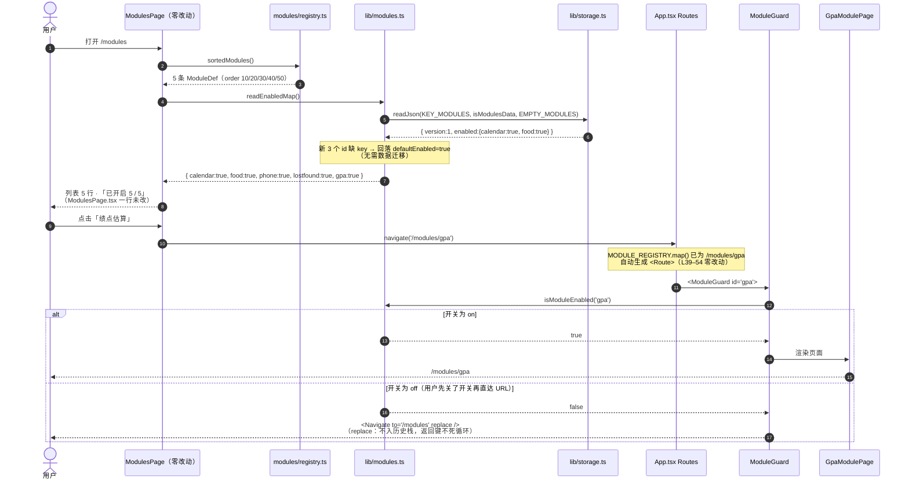
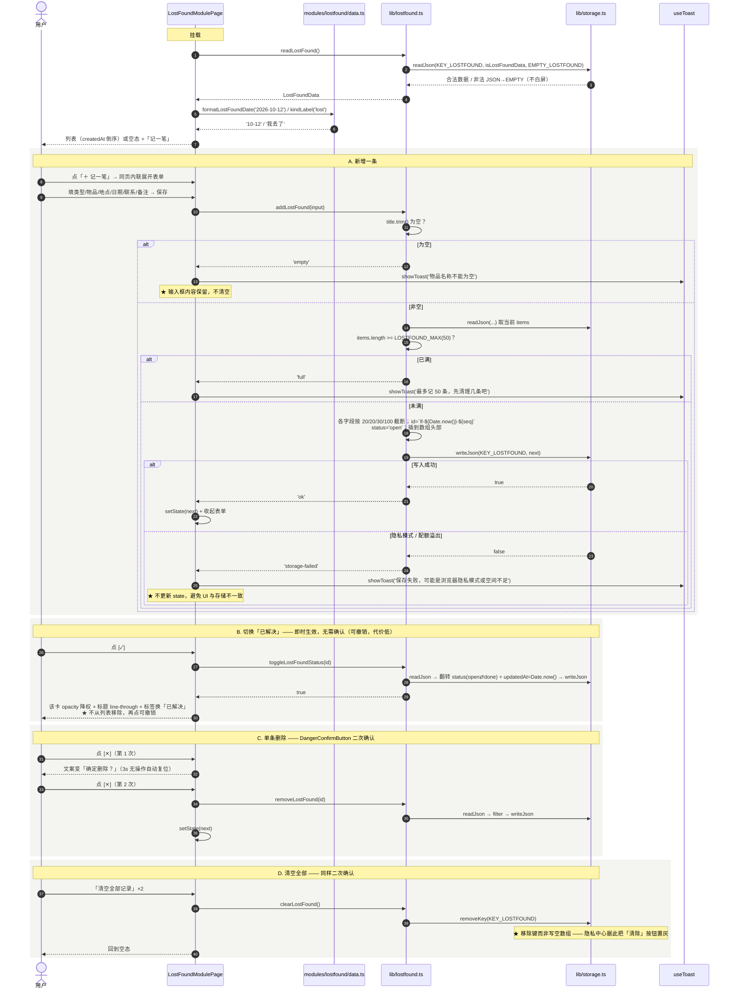
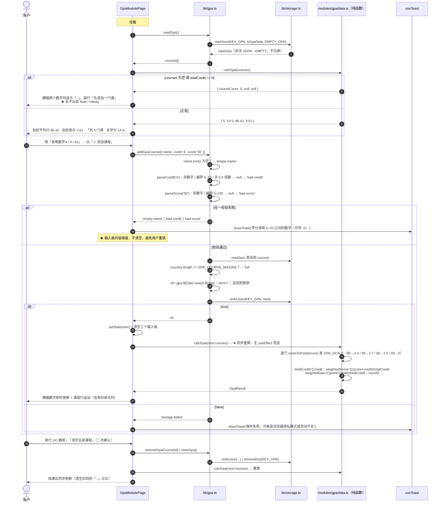
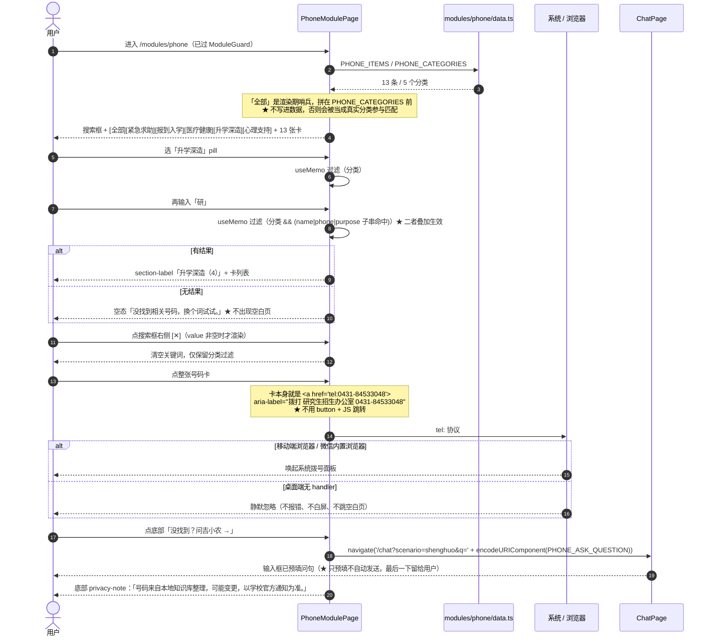
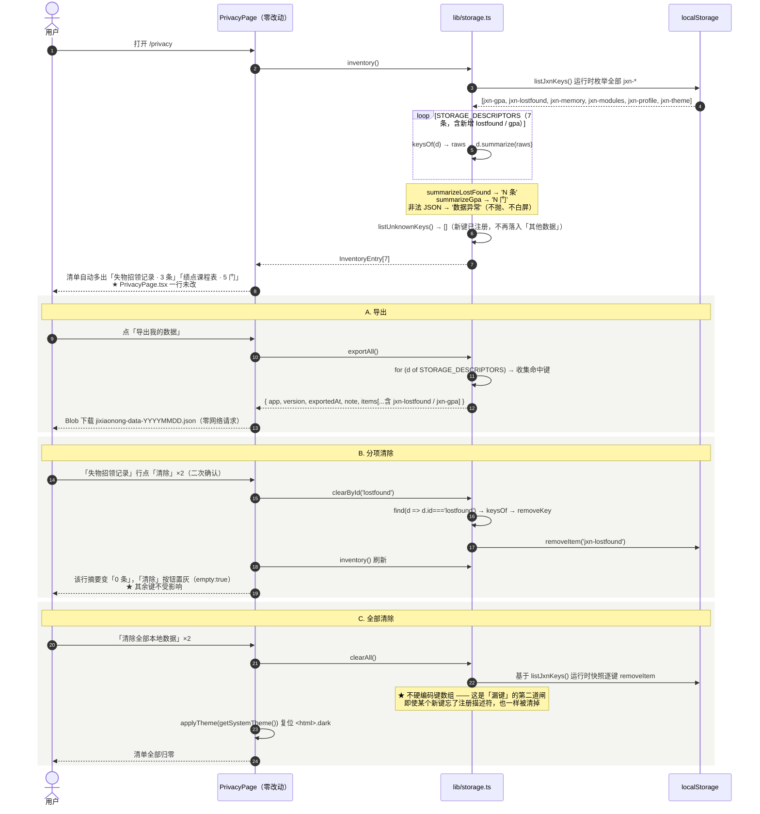
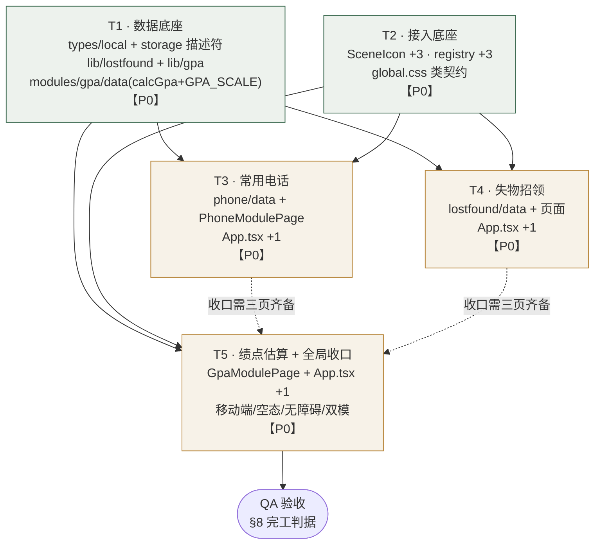

# 吉小农 · P2 功能模块扩展 · 增量架构设计与任务分解

> 架构师：高见远 · 版本：v1.0 · 类型：**增量架构（在 `docs/maimai-capabilities-arch.md` 之上叠加）**
> 上游：`docs/p2-modules-prd.md`（许清楚 v1.0）
> 下游：交付给工程师实现、QA 验收
> 范围：`jlau-ai-assistant/web/` 纯前端增量 · **后端零改动** · **新增第三方依赖 0 个**

---

## 0. 摘要（TL;DR）

| 项 | 结论 |
|---|---|
| 路线 | 纯前端增量。3 个新模块（`phone` / `lostfound` / `gpa`）全部走**既有注册表驱动**接入，不新造路由范式、不新造存储范式 |
| 新增文件 | **8 个**（3 × `modules/*/data.ts`、2 × `lib/*.ts`、3 × `pages/modules/*.tsx`） |
| 编辑文件 | **6 个**（`registry.ts` / `App.tsx` / `SceneIcon.tsx` / `types/local.ts` / `lib/storage.ts` / `global.css`） |
| 零改动文件 | `server/**`、`lib/api.ts`、`types/api.ts`、`lib/theme.ts`、`lib/tokens.ts`、`package.json`、**`ModulesPage.tsx`**、**`PrivacyPage.tsx`**、`ChatPage.tsx` |
| 新增存储键 | **2 个**：`jxn-lostfound`、`jxn-gpa`（常用电话是静态内置数据，**无存储键**） |
| 任务数 | **5 个主任务 / 24 项子任务**，全部 P0；T1 与 T2 可并行，T3–T5 各自独立只依赖 T1+T2 |
| 依赖包 | **新增 0 个** |
| 最大风险 | ①「漏键」——新键未注册描述符导致隐私中心漏显；② `calcGpa` 除零产生 `NaN`/`Infinity` 泄漏到 UI。两者均已在 §2 用**类型系统**而非约定来拦截 |

---

## 1. 实现方案

### 1.1 为什么「零后端 + 两个核心页面零改动」是可行的（已核对源码）

本增量的关键不是"写三个页面"，而是**验证既有的两条数据驱动链路是否真的不需要碰**。我逐行读了源码，结论如下：

**链路 A：模块列表 / 路由 —— `ModulesPage.tsx` git diff 可为空**

| 环节 | 源码事实 | 结论 |
|---|---|---|
| 列表渲染 | `ModulesPage.tsx:82` `const modules = sortedModules();` → `MODULE_REGISTRY.map()` | registry 加 3 条，列表自动多 3 行 |
| 开关状态 | `ModulesPage.tsx:84` `useState(() => readEnabledMap())`；`lib/modules.ts:49` `readEnabledMap()` 遍历 `MODULE_REGISTRY` 并对缺 key 回落 `defaultEnabled` | 新模块自动带上 `defaultEnabled: true`，**不需要数据迁移** |
| 计数 | 同上，`已开启 N / M` 由 `enabledMap` 与 `modules.length` 算出 | 自动从 `2 / 2` 变 `5 / 5` |
| 图标 | `<SceneIcon scene={def.icon} />` + 既有 `.scene-ico` 视觉井 | 只需 `SceneIcon` 补 3 个 case，页面零改动 |
| 路由 | `App.tsx:39` `MODULE_REGISTRY.map()` 生成带 `ModuleGuard` 的 `<Route>`；`App.tsx:42` `if (!Page) return null` 已经为"注册表有、页面未实现"兜了底 | `Routes` 内代码块**一行不改** |

> ⚠️ 既有架构文档 §2.5 把该函数写作 `readModules()`，**与实际代码不符**。实际导出的是 `lib/modules.ts:49 readEnabledMap()`（`readModules()` 也存在，但它返回的是原始 `ModulesData`，不含 `defaultEnabled` 回落）。本文档以**源码**为准，工程师不要照抄旧文档。

**链路 B：隐私中心 —— `PrivacyPage.tsx` git diff 可为空**

`PrivacyPage.tsx:19` 只 import 了 `clearAll / clearById / exportAll / exportFileName / inventory` 五个函数，**页面内没有任何键名字面量、没有任何 `id === 'profile'` 分支**。而这五个函数：

| 函数 | 源码事实（`lib/storage.ts`） | 加描述符后的行为 |
|---|---|---|
| `inventory()` | L272 `STORAGE_DESCRIPTORS.map(...)` + L285 追加 `listUnknownKeys()` | 清单自动多 2 行，摘要由描述符自带的 `summarize` 生成 |
| `exportAll()` | L324 `for (const d of STORAGE_DESCRIPTORS)` | 导出包自动含 2 个新键 |
| `clearById(id)` | L378 `STORAGE_DESCRIPTORS.find(d => d.id === id)` | 分项清除自动可用 |
| `clearAll()` | L389 `for (const key of listJxnKeys())` —— **基于运行时快照**，不含硬编码键数组 | 全清自动覆盖（甚至不注册描述符也能清掉） |
| `listUnknownKeys()` | L249 反向筛 | **第二道闸**：万一忘了注册描述符，新键会以「其他数据（jxn-gpa）」出现在清单里 —— 会难看，但不会漏 |

**结论**：两个页面的零改动**不是靠人为克制，而是这两条链路本身就是数据驱动的必然结果**。工程师若发现自己需要改这两个文件，说明设计走偏了，应回头检查。

### 1.2 技术难点与对策

| # | 难点 | 对策 | 落点 |
|---|---|---|---|
| D-1 | **漏键**：新存储键未进 `STORAGE_DESCRIPTORS`，隐私中心漏显、导出缺项 | ① 强制走 `lib/lostfound.ts` / `lib/gpa.ts` 领域层，领域层只 import `KEY_LOSTFOUND` / `KEY_GPA` 两个常量，常量与描述符同文件相邻定义，物理上难以只加其一；② `StorageDescriptorId` 联合类型 +2，漏加会**编译报错** | §2.1 |
| D-2 | **`NaN` / `Infinity` 泄漏到 UI**：`Σ(分数×学分)/Σ学分` 在总学分为 0 时除零 | `calcGpa` 返回 `weightedScore: number \| null`，**用类型强制页面处理占位分支**，而不是靠约定"记得判断一下" | §2.5 |
| D-3 | **脏数据一条毁全表**：用户手改 `jxn-gpa` 里某门课的 `credit` 为 `"abc"`，若守卫过严 → 整个 `courses` 数组回落空 | 守卫**只校验"能否安全渲染 / 计算"**（类型 + `Number.isFinite`），**不校验业务范围**（0–20 / 0–100）。范围校验放在表单提交这把闸上 | §2.3 |
| D-4 | **localStorage 5MB 配额**：失物招领若带图（base64）极易撞顶 | 已由 PRD Q3 拍板**不带图**。纯文字下 50 条 × ~200 字节 ≈ 10KB，无风险。`writeJson` 本身返回 `boolean`，配额失败时页面 Toast 提示而非崩溃 | §2.4 |
| D-5 | **`tel:` 桌面端行为**：桌面浏览器无 handler | 用**原生 `<a href="tel:...">`** 而非 `button + window.location`。无 handler 时浏览器静默忽略，不报错不白屏；iOS Safari / 微信内置浏览器兼容性最佳；无障碍语义天然正确 | §2.6 |
| D-6 | **新 SceneIcon 与既有 6 枚 / lucide `Phone` 撞脸** | 图形语言逐枚做可区分性论证（§2.7），`phone` 刻意画"号码本"而非"听筒" | §2.7 |
| D-7 | **编译顺序**：`App.tsx` 的 `MODULE_PAGES` 引用尚不存在的页面组件会导致 `tsc` 失败 | `MODULE_PAGES` 的 3 行**拆到各自页面任务**追加（T3/T4/T5 各 +1 import +1 行），而非集中在一个收尾任务。最终 diff 完全一致，但每个任务收尾都能真机走通路由 | §7 |

### 1.3 架构分层（新增部分嵌入既有分层）

```
pages/modules/*.tsx        渲染 + 交互 + 表单校验反馈（Toast）
        │ 只调领域层与 data 层，禁止碰 localStorage
        ▼
lib/lostfound.ts           领域层：业务规则（上限 / 截断 / 去空白）+ 持久化编排
lib/gpa.ts                 ——— 唯一经 lib/storage.ts 的通道
        │
        ▼
lib/storage.ts             ★ 全站唯一 localStorage 出入口 + 描述符注册表
        ▼
types/local.ts             类型 / 常量 / 守卫（零 I/O）

modules/phone/data.ts      静态数据 + 文案（无状态、无 I/O）
modules/lostfound/data.ts  展示文案 + 展示纯函数（kindLabel / formatLostFoundDate）
modules/gpa/data.ts        ★ GPA_SCALE 换算表 + calcGpa 纯函数（无状态、无 I/O、可单测）
```

**分层硬规则（工程师必须遵守）**

1. `pages/**` 出现 `localStorage` 字样 = 违规。
2. `types/local.ts` 出现任何 I/O = 违规。
3. `modules/*/data.ts` 出现 `import ... from '../../lib/storage'` = 违规（data 层必须是无状态的，才能被替换与单测）。
4. `lib/gpa.ts`（持久化）与 `modules/gpa/data.ts`（算法）**互不 import**，两者都只依赖 `types/local.ts`。这样"换一张换算表"和"改一次存储结构"是两件互不干扰的事。

---

## 2. 共享知识 / 跨文件约定

> 本节是工程师实现时的**唯一契约来源**。任何与本节不一致的实现都视为缺陷。

### 2.1 ★ `lib/storage.ts` 新增 2 个描述符（精确写法）

**Step 1 · 键常量**（追加在 `KEY_THEME` 之后，L32 附近）

```ts
export const KEY_LOSTFOUND = 'jxn-lostfound';
export const KEY_GPA = 'jxn-gpa';
```

**Step 2 · `StorageDescriptorId` 联合类型 +2**（L40）

```ts
export type StorageDescriptorId =
  | 'profile'
  | 'memory'
  | 'modules'
  | 'conversations'
  | 'lostfound'   // 🆕
  | 'gpa'         // 🆕
  | 'theme';
```

**Step 3 · 两个 `summarize` 函数**（追加在 `summarizeConversations` 之后、`summarizeTheme` 之前，与既有 4 个逐字同构）

```ts
function summarizeLostFound(raws: string[]): string {
  const raw = raws[0];
  if (typeof raw !== 'string' || raw.length === 0) return '0 条';
  const parsed = safeParse(raw);
  if (!isLostFoundData(parsed)) return '数据异常';
  return `${parsed.items.length} 条`;
}

function summarizeGpa(raws: string[]): string {
  const raw = raws[0];
  if (typeof raw !== 'string' || raw.length === 0) return '0 门';
  const parsed = safeParse(raw);
  if (!isGpaData(parsed)) return '数据异常';
  return `${parsed.courses.length} 门`;
}
```

> import 行同步扩：`import { isGpaData, isLostFoundData, isMemoryData, isModulesData, isProfileData } from '../types/local';`

**Step 4 · 描述符条目**

| 字段 | `lostfound` | `gpa` |
|---|---|---|
| `id` | `'lostfound'` | `'gpa'` |
| `key` | `KEY_LOSTFOUND` | `KEY_GPA` |
| `kind` | `'exact'` | `'exact'` |
| `label` | `'失物招领记录'` | `'绩点课程表'` |
| `purpose` | `'你在本机记下的丢失与捡到'` | `'你录入的课程学分与成绩'` |
| `managed` | `true` | `true` |
| `summarize` | `summarizeLostFound` → `'N 条'` | `summarizeGpa` → `'N 门'` |

**插入位置：`conversations` 之后、`theme` 之前。**
理由：`inventory()` 按数组顺序渲染，`theme` 是**唯一** `managed: false` 的条目，必须恒为末位，否则清单会出现"托管项 / 非托管项交错"的观感问题。

**Step 5 · 自动覆盖清单（工程师无需写任何额外代码，QA 须逐条核对）**

| 能力 | 自动覆盖机制 | QA 验证点 |
|---|---|---|
| `inventory()` | `STORAGE_DESCRIPTORS.map()` | `/privacy` 清单出现「失物招领记录 · N 条」「绩点课程表 · N 门」 |
| `exportAll()` | `for (const d of STORAGE_DESCRIPTORS)` | 导出 JSON 的 `items[]` 含 `jxn-lostfound` / `jxn-gpa` |
| `clearById('lostfound')` | `find(d => d.id === id)` | 分项「清除」只清该键，其余键不动 |
| `clearAll()` | `listJxnKeys()` 运行时快照 | 全清后 `localStorage` 内 `jxn-*` 归零 |
| `listUnknownKeys()` | 反向筛 | **注册后**新键不再出现在「其他数据」；这是"是否真的注册成功"的判定信号 |

### 2.2 `web/src/types/local.ts` 新增内容

**失物招领**

```ts
/* ================================================================
   jxn-lostfound · 失物招领
   ================================================================ */

/** 'lost' = 我丢了；'found' = 我捡到 */
export type LostFoundKind = 'lost' | 'found';
/** 'open' = 未解决；'done' = 已解决（保留在列表中，视觉降权） */
export type LostFoundStatus = 'open' | 'done';

export interface LostFoundItem {
  /** `lf-${Date.now()}-${seq}` */
  id: string;
  kind: LostFoundKind;
  /** 物品名称，必填，≤ LOSTFOUND_TITLE_MAX */
  title: string;
  /** 地点，可空，≤ LOSTFOUND_PLACE_MAX */
  place: string;
  /** 'YYYY-MM-DD'，默认今天 */
  date: string;
  /** 联系方式，可空，≤ LOSTFOUND_CONTACT_MAX */
  contact: string;
  /** 备注，可空，≤ LOSTFOUND_NOTE_MAX */
  note: string;
  status: LostFoundStatus;
  createdAt: number;
  updatedAt: number;
}

export interface LostFoundData {
  version: 1;
  /** 上限 LOSTFOUND_MAX 条 */
  items: LostFoundItem[];
}

export const LOSTFOUND_MAX = 50;
export const LOSTFOUND_TITLE_MAX = 20;
export const LOSTFOUND_PLACE_MAX = 20;
export const LOSTFOUND_CONTACT_MAX = 30;
export const LOSTFOUND_NOTE_MAX = 100;

/** ⚠️ 只读常量，不得原地修改（含内部 items 数组） */
export const EMPTY_LOSTFOUND: LostFoundData = { version: 1, items: [] };
```

**绩点**

```ts
/* ================================================================
   jxn-gpa · 绩点课程表
   ================================================================ */

export interface GpaCourse {
  /** `gpa-${Date.now()}-${seq}` */
  id: string;
  /** 课程名，必填，≤ GPA_NAME_MAX */
  name: string;
  /** 学分，0–20，允许 0.5 步长 */
  credit: number;
  /** 百分制成绩，0–100 */
  score: number;
  /** 学期标签，P0 恒为 ''（为 P1 分组预留）—— ★ 守卫必须接受空串 */
  term: string;
  createdAt: number;
}

export interface GpaData {
  version: 1;
  /** 上限 GPA_COURSE_MAX 门 */
  courses: GpaCourse[];
}

export const GPA_COURSE_MAX = 60;
export const GPA_NAME_MAX = 20;
/** 学分输入的合法区间与步长 */
export const GPA_CREDIT_MIN = 0;
export const GPA_CREDIT_MAX = 20;
export const GPA_CREDIT_STEP = 0.5;
/** 成绩输入的合法区间 */
export const GPA_SCORE_MIN = 0;
export const GPA_SCORE_MAX = 100;

/** ⚠️ 只读常量，不得原地修改 */
export const EMPTY_GPA: GpaData = { version: 1, courses: [] };
```

**守卫（复用文件内既有的 `isPlainObject`）**

```ts
export function isLostFoundKind(v: unknown): v is LostFoundKind {
  return v === 'lost' || v === 'found';
}
export function isLostFoundStatus(v: unknown): v is LostFoundStatus {
  return v === 'open' || v === 'done';
}

export function isLostFoundItem(v: unknown): v is LostFoundItem {
  if (!isPlainObject(v)) return false;
  if (typeof v.id !== 'string' || v.id.length === 0) return false;
  if (!isLostFoundKind(v.kind)) return false;
  if (typeof v.title !== 'string') return false;    // 允许空串：守卫不做业务校验
  if (typeof v.place !== 'string') return false;
  if (typeof v.date !== 'string') return false;     // ★ 不校验日期格式，见下方说明
  if (typeof v.contact !== 'string') return false;
  if (typeof v.note !== 'string') return false;
  if (!isLostFoundStatus(v.status)) return false;
  if (typeof v.createdAt !== 'number' || !Number.isFinite(v.createdAt)) return false;
  if (typeof v.updatedAt !== 'number' || !Number.isFinite(v.updatedAt)) return false;
  return true;
}

export function isLostFoundData(v: unknown): v is LostFoundData {
  if (!isPlainObject(v)) return false;
  if (v.version !== 1) return false;
  if (!Array.isArray(v.items)) return false;
  return v.items.every(isLostFoundItem);
}

export function isGpaCourse(v: unknown): v is GpaCourse {
  if (!isPlainObject(v)) return false;
  if (typeof v.id !== 'string' || v.id.length === 0) return false;
  if (typeof v.name !== 'string') return false;
  if (typeof v.credit !== 'number' || !Number.isFinite(v.credit)) return false;  // ★ 不查 0–20
  if (typeof v.score !== 'number' || !Number.isFinite(v.score)) return false;    // ★ 不查 0–100
  if (typeof v.term !== 'string') return false;   // ★ 空串合法（P0 恒为 ''）
  if (typeof v.createdAt !== 'number' || !Number.isFinite(v.createdAt)) return false;
  return true;
}

export function isGpaData(v: unknown): v is GpaData {
  if (!isPlainObject(v)) return false;
  if (v.version !== 1) return false;
  if (!Array.isArray(v.courses)) return false;
  return v.courses.every(isGpaCourse);
}
```

**★ 守卫设计原则（ADR，必须理解后再动手）**

> **守卫只回答"这条数据能不能被安全地渲染与计算"，不回答"这条数据合不合业务规则"。**
>
> 具体：`credit: 999` 通过守卫（能算、能显示），但**通不过 `addGpaCourse` 的表单闸**（0–20）。
> 为什么不在守卫里查范围？因为 `every()` 是全或无 —— 用户手改一条脏数据会导致**整个数组回落空**，60 门课全丢。
> 而 `Number.isFinite` 拦掉 `NaN` / `Infinity` / `"abc"` 已经足够保证 `calcGpa` 不产出 `NaN`。
>
> 同理 `date` 不校验 `YYYY-MM-DD` 格式：格式错只影响一条记录的日期显示（由 `formatLostFoundDate` 兜底回落原串），不值得让整块数据消失。

### 2.3 领域层函数签名

**`web/src/lib/lostfound.ts`**（对齐 `lib/profile.ts` 的分层与写法）

```ts
export type LostFoundAddResult = 'ok' | 'empty' | 'full' | 'storage-failed';

export interface LostFoundInput {
  kind: LostFoundKind;
  title: string;
  place: string;
  date: string;
  contact: string;
  note: string;
}

/** 读取；无数据 / 非法 JSON / 守卫不过一律回落 EMPTY_LOSTFOUND，绝不抛出 */
export function readLostFound(): LostFoundData;

/**
 * 新增一条。校验顺序（与 §5 时序图一致）：
 *   title 去空白后为空 → 'empty'
 *   items.length >= LOSTFOUND_MAX → 'full'
 *   其余字段按各自上限截断（超长不拒绝）→ 写入 → 'ok' / 'storage-failed'
 * 新条目插在数组头部（createdAt 倒序），页面不需要再排序。
 */
export function addLostFound(input: LostFoundInput): LostFoundAddResult;

/** 切换 open ⇄ done，同时刷新 updatedAt；id 不存在时静默返回 false */
export function toggleLostFoundStatus(id: string): boolean;

/** 删除一条；id 不存在时静默返回 */
export function removeLostFound(id: string): void;

/** 清空全部（移除整个键，而非写入空数组 —— 与隐私中心 clearById 行为一致） */
export function clearLostFound(): void;

/** 'YYYY-MM-DD' 本地日期，供表单 input[type=date] 的默认值 */
export function todayIso(): string;
```

**`web/src/lib/gpa.ts`**

```ts
export type GpaAddResult =
  | 'ok'
  | 'empty-name'
  | 'bad-credit'
  | 'bad-score'
  | 'full'
  | 'storage-failed';

/** 表单原始字符串输入 —— 解析与范围校验统一收在领域层这把闸里，页面不重复实现 */
export interface GpaCourseInput {
  name: string;
  credit: string;
  score: string;
}

export function readGpa(): GpaData;

/**
 * 新增一门课。校验顺序：
 *   name 去空白后为空 → 'empty-name'
 *   parseCredit 失败   → 'bad-credit'
 *   parseScore  失败   → 'bad-score'
 *   courses.length >= GPA_COURSE_MAX → 'full'
 *   → 写入（term 恒为 ''，追加到数组尾部，保持录入顺序）
 */
export function addGpaCourse(input: GpaCourseInput): GpaAddResult;

export function removeGpaCourse(id: string): void;
export function clearGpa(): void;

/** 解析学分：非数字 / 越界(0–20) / 非 0.5 整数倍 → null */
export function parseCredit(raw: string): number | null;
/** 解析成绩：非数字 / 越界(0–100) → null。允许小数（如 88.5） */
export function parseScore(raw: string): number | null;
```

> **`clearXxx()` 用 `removeKey` 而不是写空对象**：与 `clearById` 的语义保持一致 —— 清除后 `listJxnKeys()` 里该键消失，隐私中心的「清除」按钮自动置灰（`empty: true`）。若写空对象，键仍在，按钮不灰，观感不一致。

### 2.4 存储失败的统一处理

`writeJson` 返回 `boolean`（隐私模式 / 配额溢出为 `false`）。三个页面统一：

| 场景 | 页面行为 |
|---|---|
| 写入成功 | 刷新本地 state，必要时 Toast「已保存」 |
| 写入失败 | **不更新 state**（避免 UI 与存储不一致），Toast「保存失败，可能是浏览器隐私模式或空间不足」 |

### 2.5 ★ `calcGpa` 纯函数契约（`modules/gpa/data.ts`）

```ts
/** 换算表的一段。min / max 均为闭区间 */
export interface GpaScaleBand {
  min: number;
  max: number;
  point: number;
  /** 展示用，如 '90–100' */
  label: string;
}

/**
 * ★★ 4.0 分段制换算表 —— 本模块唯一的可替换点 ★★
 * 未经吉林农业大学教务处核实，属占位规则（沿用校历模块的「占位标注 + 低成本替换」协议）。
 * 替换官方口径时：**只改这一个数组**，calcGpa / 页面 / 类型全部零改动。
 * 约束：必须覆盖 0–100 全区间、区间不重叠、按 min 降序排列。
 */
export const GPA_SCALE: readonly GpaScaleBand[] = [
  { min: 90, max: 100, point: 4.0, label: '90–100' },
  { min: 85, max: 89,  point: 3.7, label: '85–89'  },
  { min: 82, max: 84,  point: 3.3, label: '82–84'  },
  { min: 78, max: 81,  point: 3.0, label: '78–81'  },
  { min: 75, max: 77,  point: 2.7, label: '75–77'  },
  { min: 72, max: 74,  point: 2.3, label: '72–74'  },
  { min: 68, max: 71,  point: 2.0, label: '68–71'  },
  { min: 64, max: 67,  point: 1.5, label: '64–67'  },
  { min: 60, max: 63,  point: 1.0, label: '60–63'  },
  { min: 0,  max: 59,  point: 0,   label: '0–59'   },
];

/** 算法名，结果区显式展示 */
export const GPA_SCHEME_NAME = '4.0 分段制';
export const GPA_DISCLAIMER =
  '本页采用 4.0 分段制换算，仅供参考，实际绩点以教务处认定为准。课程数据只保存在这台设备上。';

/**
 * 单科分数 → 单科绩点。
 * 防御：非有限数 → 0；越界先 clamp 到 [0,100] 再匹配（手改数据不产生 undefined）。
 */
export function scoreToPoint(score: number): number;

export interface GpaResult {
  /** 课程门数 */
  courseCount: number;
  /** 总学分，保留 2 位小数 */
  totalCredit: number;
  /** 加权平均分，保留 2 位小数；★ 总学分 ≤ 0 时为 null（页面渲染 '--'） */
  weightedScore: number | null;
  /** 加权绩点，保留 2 位小数；★ 总学分 ≤ 0 时为 null */
  weightedGpa: number | null;
}

/**
 * 纯函数：无副作用、不读存储、不读时间。QA 可直接单测。
 *
 * 算法：
 *   totalCredit   = Σ credit
 *   weightedScore = Σ(score × credit) / totalCredit
 *   weightedGpa   = Σ(scoreToPoint(score) × credit) / totalCredit
 *
 * 边界（★ 硬要求，永不产出 NaN / Infinity）：
 *   courses 为空          → { 0, 0, null, null }
 *   totalCredit <= 0      → { N, 0, null, null }   ← 含全 0 学分、负学分、脏数据
 *   非有限的 credit/score → 该门课整条跳过，不参与分子分母
 */
export function calcGpa(courses: readonly GpaCourse[]): GpaResult;
```

**QA 必测边界（工程师自测同样按这张表）**

| 用例 | 输入 | 期望 |
|---|---|---|
| E-1 零课程 | `[]` | `{0, 0, null, null}` |
| E-2 全 0 学分 | `[{credit:0,score:90}]` | `{1, 0, null, null}`，**不出现 NaN** |
| E-3 边界 90 | `[{credit:1,score:90}]` | `weightedGpa === 4.0` |
| E-4 边界 89 | `[{credit:1,score:89}]` | `weightedGpa === 3.7` |
| E-5 边界 60 | `[{credit:1,score:60}]` | `weightedGpa === 1.0` |
| E-6 边界 59 | `[{credit:1,score:59}]` | `weightedGpa === 0` |
| E-7 加权 | `[{4,92},{2,80}]` | `totalCredit 6`；`weightedScore 88.00`；`weightedGpa (4.0×4+3.0×2)/6 = 3.67` |
| E-8 脏数据 | `[{credit:NaN,score:90},{credit:2,score:80}]` | 第一条跳过，结果等同只有第二条 |
| E-9 越界成绩 | `[{credit:1,score:120}]` | clamp → `point 4.0`，不 `undefined` |

**舍入**：`round2(x) = Math.round(x * 100) / 100`。这是 JS 浮点的通行做法，`.005` 附近可能有 1 个最小单位的偏差，属可接受范围（本模块是"估算器"，不是记账系统）。若后续 QA 要求严格半值进位，改 `round2` 一个函数即可。

### 2.6 常用电话数据契约（`modules/phone/data.ts`）

```ts
export type PhoneCategory = '紧急求助' | '报到入学' | '医疗健康' | '升学深造' | '心理支持';

/** 「全部」不是真实分类，由页面渲染时拼在前面，不写进数据（沿用 FoodModulePage 做法） */
export const PHONE_CATEGORIES: readonly PhoneCategory[] = [
  '紧急求助', '报到入学', '医疗健康', '升学深造', '心理支持',
];

export interface PhoneItem {
  id: string;               // 稳定 id，如 'zhaosheng'
  name: string;             // 机构 / 用途名
  phone: string;            // ★ 只含数字与短横线，供 tel: 使用
  category: PhoneCategory;
  purpose: string;          // 一句话用途，≤30 字
  source: string;           // ★ 非空来源标注
}

export const PHONE_ITEMS: readonly PhoneItem[] = [ /* 13 条，见下表 */ ];

export const PHONE_DISCLAIMER =
  '号码来自本地知识库整理，可能变更，以学校官方通知为准。';

/** 页面底部引流回对话的预填问句 */
export const PHONE_ASK_QUESTION = '我想找学校某个部门的电话，能帮我查一下吗？';
```

**数据集（13 条，逐条可溯源；严禁臆造）**

| id | name | phone | category | source |
|---|---|---|---|---|
| `zhaosheng` | 招生就业工作处 | `0431-84532980` | 报到入学 | 知识库 01-报到流程 / 11-联系方式求助 |
| `zhaosheng-appeal` | 招生申诉 | `0431-84532752` | 报到入学 | 知识库 11-联系方式求助 |
| `hospital` | 吉林农业大学医院 | `0431-84532820` | 医疗健康 | 知识库 18-医疗校医院周边医院 |
| `yanzhao-1` | 研究生招生办公室 | `0431-84533048` | 升学深造 | 知识库 11-联系方式求助 |
| `yanzhao-2` | 研究生招生办公室（备用线） | `0431-84533049` | 升学深造 | 知识库 11-联系方式求助 |
| `yangong-1` | 党委研究生工作部教育管理科（档案接收） | `0431-84533149` | 升学深造 | 知识库 06-档案转接 / 11-联系方式求助 |
| `yangong-2` | 党委研究生工作部教育管理科（备用线） | `0431-84533305` | 升学深造 | 知识库 06-档案转接 / 11-联系方式求助 |
| `police` | 报警 | `110` | 紧急求助 | 全国公共号码 |
| `fire` | 火警 | `119` | 紧急求助 | 全国公共号码 |
| `ambulance` | 急救 | `120` | 紧急求助 | 全国公共号码 |
| `traffic` | 交通事故报警 | `122` | 紧急求助 | 全国公共号码 |
| `antifraud` | 全国反诈专线 | `96110` | 紧急求助 | 全国公共号码 |
| `psych` | 全国心理援助热线 | `12356` | 心理支持 | 全国公共号码 |

> ✅ 13 条 ≥ 10 条、5 个分类 ≥ 4 个 —— 满足 PRD-P2-01 AC②。
> `purpose` 字段由工程师按各条实际用途填写（≤30 字），不得留空。

### 2.7 `SceneIcon` 扩 3 枚（图形语言契约）

```ts
export type SceneId =
  | 'baodao' | 'xuanke' | 'kaoyan' | 'shenghuo' | 'calendar' | 'food'
  | 'phone' | 'lostfound' | 'gpa';   // 🆕
```

**硬约束（与既有 6 枚逐条一致）**：24×24 网格 · `fill="none"` · `stroke="currentColor"` · `strokeWidth 1.75`（由 `SceneIcon` 组件统一注入，**case 内只写 `<path d>`，不写任何 fill / stroke / 颜色属性**）· `strokeLinecap/Linejoin="round"` · **hex = 0 · `<linearGradient>` = 0 · 实色 `fill` = 0** · 无人脸 / 五官 / 四肢。

| SceneId | 构图元素清单（必须齐备） | 可区分性论证 | 参考实现（可微调，元素清单不可减） |
|---|---|---|---|
| `phone` | ① 纵向纸页矩形（号码本本体）② 右侧 2–3 道短横索引齿 ③ 页面内一枚小听筒轮廓 | 直接画听筒会与 lucide `Phone` 撞脸（顶栏「转人工」已在用），用户会以为是同一个功能。**"纸页 + 索引齿"把语义从「正在通话」推向「号码名录」** | `M6 3.5h11a1 1 0 0 1 1 1v15a1 1 0 0 1-1 1H6V3.5Z` · `M18 8h2.5` · `M18 12h2.5` · `M18 16h2.5` · `M9.5 8.5c0 4 2 6 5 6.5v-2l-2-.8-1 1a5 5 0 0 1-2-2l1-1-.8-2h-2Z` |
| `lostfound` | ① 一角斜切的吊牌轮廓 ② 挂孔圆点 ③ 牌面一枚抽象问号笔画 | 纯吊牌 = 通用 Tag 图标，语义是"标签/价格"。**问号笔画是与 Tag 的关键区分点**，也直观传达"这东西是谁的？" | `M4 10.5 10.5 4H19a1 1 0 0 1 1 1v8.5L13.5 20a1 1 0 0 1-1.4 0l-8-8a1 1 0 0 1 0-1.5Z` · `M16 8h.01` · `M10 11.5a1.6 1.6 0 1 1 2.2 1.5c-.6.3-.9.8-.9 1.4` · `M11.4 16.6h.01` |
| `gpa` | ① 三根高低不同的竖柱 ② 一条横跨柱顶的水平线 ③（可选）底部基线 | 三根竖柱 = 通用柱状图。**横跨柱顶的水平线是关键区分点** —— 它把"一堆分数"变成"一个平均值"，直接图示「加权平均」这个动作 | `M6.5 19v-6` · `M12 19V8.5` · `M17.5 19v-9` · `M4 14.5h16`（跨柱顶均线）· `M3.5 21h17`（基线） |

> `renderScene` 的 `switch` 加 3 个 case，**`default` 分支仍归 `shenghuo`**（既有兜底行为不变）。

### 2.8 `MODULE_REGISTRY` 新增 3 条（精确字段）

```ts
{ id: 'phone',     name: '常用电话', desc: '校内号码一键拨',  icon: 'phone',     path: '/modules/phone',     defaultEnabled: true, order: 30 },
{ id: 'lostfound', name: '失物招领', desc: '本机记一笔丢与捡', icon: 'lostfound', path: '/modules/lostfound', defaultEnabled: true, order: 40 },
{ id: 'gpa',       name: '绩点估算', desc: '算算这学期绩点',  icon: 'gpa',       path: '/modules/gpa',       defaultEnabled: true, order: 50 },
```

| 约束 | 检查 |
|---|---|
| `desc` ≤ 14 字 | 7 / 8 / 7 字 ✅ |
| `id` 一经发布不得改名 | 它同时是 `jxn-modules.enabled` 的 key |
| `icon` 必须是 `SceneId` 的合法取值 | 依赖 §2.7 先落地，否则编译报错 |
| `order` 步长 10 | 排在 calendar(10) / food(20) 之后，中间仍可插入 |
| `registry.ts` 禁止 import 页面组件 | 否则形成环：registry → page → ModuleGuard → lib/modules → registry |

### 2.9 `App.tsx` 的 `MODULE_PAGES` 追加 3 行

```ts
const MODULE_PAGES: Record<string, ComponentType> = {
  calendar: CalendarModulePage,
  food: FoodModulePage,
  phone: PhoneModulePage,           // 🆕 T3
  lostfound: LostFoundModulePage,   // 🆕 T4
  gpa: GpaModulePage,               // 🆕 T5
};
```

**允许的 diff 仅有**：3 行 `import` + 3 行查找表项。
**`Routes` 内的 `MODULE_REGISTRY.map()` 代码块（L39–L54）必须零改动** —— 这是 PRD-P2-04 AC② 的硬判据。

### 2.10 `global.css` 新增类契约（T2 定义，T3–T5 消费）

| 类名 | 用途 | 关键规范 |
|---|---|---|
| `.phone-search` / `.phone-search-input` / `.phone-search-clear` | 关键词搜索框 | 结构参照 `.form-input`；清除按钮 `min-width:44px; min-height:44px`，`value` 非空才渲染；`:focus-visible` 用 `--focus-ring` |
| `.phone-list` / `.phone-card` | 号码卡 | 结构对齐 `.food-card`：`--surface` + `1px solid var(--border-soft)` + `--radius-lg`，**无阴影**；整卡为 `<a>`，`min-height: 44px`；`@media (hover:hover)` 下 `:hover` 底色 `--surface-warm` |
| `.phone-card-name` / `.phone-card-tag` / `.phone-card-tag.is-urgent` | 名称 + 分类微标 | 微标常态 `--muted` 文字；`.is-urgent` 用 `--danger` **文字色**（不做实色红底，不占 accent 配额） |
| `.phone-card-num` | 号码行 | `--font-mono` + `font-variant-numeric: tabular-nums`（对齐 `.timetable-time`） |
| `.phone-card-purpose` / `.phone-card-src` | 用途 / 来源 | `--fg-2` / `--meta`；来源用 `--text-xs` |
| `.lf-form` | 折叠新增表单 | 内部用既有 `.form-row`；展开/收起仅切显隐，`prefers-reduced-motion` 下无过渡 |
| `.lf-list` / `.lf-card` | 记录卡 | 同 `.food-card` 基座；`border-left: 2px solid transparent` 预留竖条位 |
| `.lf-card.is-lost` / `.lf-card.is-found` | 类型双通道 ② | `border-left-color: var(--accent)` / `var(--grain)`。**2px 细线不构成实色块，不占配额**；类型文案是通道 ① |
| `.lf-card.is-done` | 已解决降权 | 整卡 `opacity: .55`；`.lf-title` 加 `text-decoration: line-through`；**不从列表移除** |
| `.lf-kind` / `.lf-title` / `.lf-meta` / `.lf-line` | 卡内元素 | `.lf-meta` = 日期 + 地点，`--muted`；`.lf-line` = contact / note，非空才渲染 |
| `.lf-actions` / `.lf-act` | 卡内动作区 | 每个按钮 `min-width:44px; min-height:44px`；`[✓]` 即时生效，`[✕]` 走 `.danger-btn` 二次确认 |
| `.gpa-banner` / `.gpa-banner-cell` | 结果横幅 | `--grain-soft` 底 + `--grain-deep` 字（对齐 `.countdown-banner`），本屏**唯一** grain；`--radius-lg`；两列等宽 |
| `.gpa-banner-num` / `.gpa-banner-label` / `.gpa-banner-sub` | 横幅内文 | 数字 `--font-mono` + `tabular-nums` + `--text-2xl`；**占位态渲染 `--`，宽度不抖** |
| `.gpa-add` / `.gpa-add-field` | 添加表单 | `flex-wrap: wrap`，窄屏自动换行；输入框沿用 `.form-input`；按钮 `.btn .btn-primary` |
| `.gpa-list` / `.gpa-row` | 课程行 | 结构对齐 `.timetable-row`：发丝线分隔；名称列 `min-width: 0` + `text-overflow: ellipsis` |
| `.gpa-row-num` / `.gpa-row-point` | 数字列 | `--font-mono` + `tabular-nums` + 右对齐 |
| `.gpa-row-del` | 单行删除 | 复用 `.btn-ghost` + `<Icon name="X" size="inline" />`，`min-width:44px; min-height:44px`，`aria-label="删除 {课程名}"` |
| `.food-ask, .ask-jxn` | 「问吉小农」链接 | **把 `.ask-jxn` 追加进既有 `.food-ask` 选择器组**（含 `:hover` / `:focus-visible` 三处），零规则重复，且**不必修改 `FoodModulePage.tsx`** |

**样式硬约束（继承 `design_refresh_system.md`，逐条不可违反）**

1. 禁裸 hex（`#fff` / `#000` 例外）—— 一律走 CSS 变量。
2. 变量名 kebab 数字边界：`--accent-2` ✅ / `--accent2` ❌；`--fg-2` ✅ / `--fg2` ❌。
3. 禁 `backdrop-filter`；`box-shadow` 不得带彩色（`--focus-ring` 是唯一例外）。
4. 禁 `<linearGradient>`、禁彩色 glow。
5. 尺寸只用 4 的倍数（1px 发丝线 / 2px 强调条例外）。
6. 深浅色**只靠 `<html>.dark` 变量级联**，不写第二套选择器。
7. `prefers-reduced-motion: reduce` 下关闭所有过渡与动画。
8. 移动端所有可点区域 ≥ 44×44 px。

### 2.11 三页共用骨架与用色配额

```
<AppShell title="{模块名}" onBack={() => navigate(-1)}>
  <div className="page-scroll">
    <div className="page-pad">
      <div className="screen-header">
        <div className="screen-title">…</div>
        <div className="screen-sub">…</div>
      </div>
      …主体（若干 .section + .section-label）…
      <div className="section">
        <div className="privacy-note">…免责 / 隐私说明…</div>
      </div>
    </div>
  </div>
  {toastNode}
</AppShell>
```

| 页面 | `--accent` 实色 | `--grain` | 浮起卡 |
|---|---|---|---|
| `/modules/phone` | 1 处（选中的分类 pill） | 0 | 0 |
| `/modules/lostfound` | 2 处（「记一笔」CTA、选中的类型 pill） | 0（2px 竖条不算） | 0 |
| `/modules/gpa` | 1 处（「添加课程」按钮） | 1 处（结果横幅 `--grain-soft` 底） | 0 |

**组件内联决策（延续既有约定）**：`PhoneCard` / `PhoneSearchBar` / `FilterPills` / `LostFoundCard` / `LostFoundForm` / `GpaResultBanner` / `GpaCourseRow` / `GpaAddForm` 均**只被单一页面消费**，一律作为同文件内的私有子组件实现，**不单独建文件**。仅当被 ≥2 页复用时才提取。

### 2.12 可直接复用的既有资产（不要重写）

| 资产 | 位置 | 签名要点 |
|---|---|---|
| `AppShell` | `components/NavBar.tsx` | `title` + `onBack` |
| `FormRow` | `components/FormRow.tsx` | `{ label, children, htmlFor? }` |
| `PillRadio<T extends string>` | `components/FormRow.tsx` | `{ options, value, onChange, groupLabel }`，`role="radiogroup"` |
| `DangerConfirmButton` | `components/DangerConfirmButton.tsx` | `{ label, confirmLabel, onConfirm, disabled?, className? }`，3s 自动复位 |
| `useToast()` | `components/Toast.tsx` | 返回 `{ toastNode, showToast }`，`toastNode` 塞进页面 JSX 尾部 |
| `Icon` | `components/Icon.tsx` | `Phone` / `Plus` / `Trash2` / `X` / `ArrowRight` / `CheckCircle` **均已在注册表内，P0 无需扩注册表** |
| `.filter-pills` + `.pill-radio-item.is-on` | `styles/global.css` | 横向滚动筛选组，参照 `FoodModulePage:26–53` |
| `readJson` / `writeJson` / `removeKey` | `lib/storage.ts` | **唯一** localStorage 通道 |

---

## 3. 文件列表（相对 `jlau-ai-assistant/`）

### 3.1 新增（8）

| # | 文件 | 职责 | 关键导出 |
|---|---|---|---|
| 1 | `web/src/modules/phone/data.ts` | 常用电话静态数据 + 文案（无状态、无 I/O） | `PhoneCategory` · `PHONE_CATEGORIES` · `PhoneItem` · `PHONE_ITEMS`(13) · `PHONE_DISCLAIMER` · `PHONE_ASK_QUESTION` |
| 2 | `web/src/modules/lostfound/data.ts` | 失物招领展示文案 + 展示纯函数（无静态条目、无 I/O） | `LOSTFOUND_KIND_OPTIONS`(['我丢了','我捡到']) · `kindLabel(kind)` · `kindOf(label)` · `formatLostFoundDate(iso)`→`'MM-DD'`（非法回落原串） · `LOSTFOUND_PRIVACY_NOTE` · `LOSTFOUND_EMPTY_HINT` |
| 3 | `web/src/modules/gpa/data.ts` | ★ 换算表 + 计算纯函数（无状态、无 I/O、可单测） | `GpaScaleBand` · **`GPA_SCALE`** · `GPA_SCHEME_NAME` · `GPA_DISCLAIMER` · `scoreToPoint(score)` · `GpaResult` · **`calcGpa(courses)`** |
| 4 | `web/src/lib/lostfound.ts` | 失物招领领域层（唯一经 `storage.ts` 读写） | `LostFoundAddResult` · `LostFoundInput` · `readLostFound` · `addLostFound` · `toggleLostFoundStatus` · `removeLostFound` · `clearLostFound` · `todayIso` |
| 5 | `web/src/lib/gpa.ts` | 绩点领域层（唯一经 `storage.ts` 读写） | `GpaAddResult` · `GpaCourseInput` · `readGpa` · `addGpaCourse` · `removeGpaCourse` · `clearGpa` · `parseCredit` · `parseScore` |
| 6 | `web/src/pages/modules/PhoneModulePage.tsx` | `/modules/phone`：搜索 + 分类过滤 + `tel:` 卡片 + 底部引流 | `PhoneModulePage` |
| 7 | `web/src/pages/modules/LostFoundModulePage.tsx` | `/modules/lostfound`：折叠表单 + 列表 + 已解决切换 + 删除 + 清空 | `LostFoundModulePage` |
| 8 | `web/src/pages/modules/GpaModulePage.tsx` | `/modules/gpa`：结果横幅 + 添加表单 + 课程行 + 清空 | `GpaModulePage` |

### 3.2 编辑（6）

| # | 文件 | 改动范围 | 允许的 diff |
|---|---|---|---|
| 1 | `web/src/types/local.ts` | +2 组类型 / 常量 / 守卫 | 纯追加，既有内容零改动 |
| 2 | `web/src/lib/storage.ts` | +2 键常量、`StorageDescriptorId` +2、+2 `summarize`、+2 描述符、import 行扩 | 纯追加 + 1 行 import 修改；`readJson`/`writeJson`/`inventory`/`exportAll`/`clearById`/`clearAll` **函数体零改动** |
| 3 | `web/src/modules/registry.ts` | `MODULE_REGISTRY` +3 条 | 仅数组内追加；`sortedModules`/`findModule`/`findModuleByPath` 零改动 |
| 4 | `web/src/components/SceneIcon.tsx` | `SceneId` +3、`renderScene` +3 case | 组件主体（`SceneIcon` 函数）零改动 |
| 5 | `web/src/App.tsx` | +3 import、`MODULE_PAGES` +3 行 | **`Routes` 内 L39–L54 零改动** |
| 6 | `web/src/styles/global.css` | +§2.10 全部类；`.food-ask` 选择器组追加 `.ask-jxn` | 既有规则零修改（`.food-ask` 三处仅扩选择器，不改声明） |

### 3.3 明确不动（9）

`server/**` · `web/src/lib/api.ts` · `web/src/types/api.ts` · `web/src/lib/theme.ts` · `web/src/lib/tokens.ts` · `web/package.json` · `web/src/pages/ModulesPage.tsx` · `web/src/pages/PrivacyPage.tsx` · `web/src/pages/ChatPage.tsx`

> 后 3 项不是"约束"，而是 §1.1 论证的**必然结果**。若发现必须改，说明设计走偏，回头查而不是硬改。

---

## 4. 数据结构与接口（类图）

```mermaid
classDiagram
    direction LR

    %% ============ types/local.ts（零 I/O） ============
    class LostFoundItem {
        +string id
        +LostFoundKind kind
        +string title
        +string place
        +string date
        +string contact
        +string note
        +LostFoundStatus status
        +number createdAt
        +number updatedAt
    }
    class LostFoundData {
        +1 version
        +LostFoundItem[] items
    }
    class GpaCourse {
        +string id
        +string name
        +number credit
        +number score
        +string term
        +number createdAt
    }
    class GpaData {
        +1 version
        +GpaCourse[] courses
    }
    class LocalGuards {
        <<module types/local.ts>>
        +isLostFoundKind(unknown) bool
        +isLostFoundStatus(unknown) bool
        +isLostFoundItem(unknown) bool
        +isLostFoundData(unknown) bool
        +isGpaCourse(unknown) bool
        +isGpaData(unknown) bool
        +LOSTFOUND_MAX: 50
        +GPA_COURSE_MAX: 60
        +EMPTY_LOSTFOUND
        +EMPTY_GPA
    }

    %% ============ lib/storage.ts（唯一 localStorage 出口） ============
    class StorageDescriptor {
        +StorageDescriptorId id
        +string key
        +StorageKind kind
        +string label
        +string purpose
        +bool managed
        +summarize(string[]) string
    }
    class Storage {
        <<module lib/storage.ts>>
        +KEY_LOSTFOUND: 'jxn-lostfound'
        +KEY_GPA: 'jxn-gpa'
        +STORAGE_DESCRIPTORS: StorageDescriptor[7]
        +readJson~T~(key, guard, fallback) T
        +writeJson(key, value) bool
        +removeKey(key) void
        +inventory() InventoryEntry[]
        +exportAll() ExportBundle
        +clearById(id) void
        +clearAll() void
        +listUnknownKeys() string[]
    }

    %% ============ 领域层 ============
    class LibLostFound {
        <<module lib/lostfound.ts>>
        +readLostFound() LostFoundData
        +addLostFound(LostFoundInput) LostFoundAddResult
        +toggleLostFoundStatus(id) bool
        +removeLostFound(id) void
        +clearLostFound() void
        +todayIso() string
    }
    class LibGpa {
        <<module lib/gpa.ts>>
        +readGpa() GpaData
        +addGpaCourse(GpaCourseInput) GpaAddResult
        +removeGpaCourse(id) void
        +clearGpa() void
        +parseCredit(string) number|null
        +parseScore(string) number|null
    }

    %% ============ data 层（无状态、可替换、可单测） ============
    class PhoneData {
        <<module modules/phone/data.ts>>
        +PHONE_CATEGORIES: PhoneCategory[5]
        +PHONE_ITEMS: PhoneItem[13]
        +PHONE_DISCLAIMER
        +PHONE_ASK_QUESTION
    }
    class PhoneItem {
        +string id
        +string name
        +string phone
        +PhoneCategory category
        +string purpose
        +string source
    }
    class LostFoundDisplay {
        <<module modules/lostfound/data.ts>>
        +LOSTFOUND_KIND_OPTIONS
        +kindLabel(LostFoundKind) string
        +formatLostFoundDate(string) string
        +LOSTFOUND_PRIVACY_NOTE
    }
    class GpaAlgo {
        <<module modules/gpa/data.ts>>
        +GPA_SCALE: GpaScaleBand[10]
        +GPA_SCHEME_NAME
        +GPA_DISCLAIMER
        +scoreToPoint(number) number
        +calcGpa(GpaCourse[]) GpaResult
    }
    class GpaScaleBand {
        +number min
        +number max
        +number point
        +string label
    }
    class GpaResult {
        +number courseCount
        +number totalCredit
        +number|null weightedScore
        +number|null weightedGpa
    }

    %% ============ 注册与路由 ============
    class ModuleDef {
        +string id
        +string name
        +string desc
        +SceneId icon
        +string path
        +bool defaultEnabled
        +number order
    }
    class Registry {
        <<module modules/registry.ts>>
        +MODULE_REGISTRY: ModuleDef[5]
        +sortedModules() ModuleDef[]
        +findModule(id) ModuleDef
    }
    class App {
        <<App.tsx>>
        +MODULE_PAGES: Record~string,ComponentType~
    }
    class SceneIconC {
        <<components/SceneIcon.tsx>>
        +SceneId: 9 values
        +renderScene(SceneId)
    }

    %% ============ 页面 ============
    class PhoneModulePage
    class LostFoundModulePage
    class GpaModulePage

    LostFoundData "1" *-- "0..50" LostFoundItem
    GpaData "1" *-- "0..60" GpaCourse
    PhoneData "1" *-- "13" PhoneItem
    GpaAlgo "1" *-- "10" GpaScaleBand
    GpaAlgo ..> GpaResult : returns
    GpaAlgo ..> GpaCourse : reads

    Storage "1" *-- "7" StorageDescriptor
    Storage ..> LocalGuards : uses guards in summarize
    LibLostFound --> Storage : readJson/writeJson/removeKey
    LibGpa --> Storage : readJson/writeJson/removeKey
    LibLostFound ..> LostFoundData
    LibGpa ..> GpaData

    PhoneModulePage --> PhoneData
    LostFoundModulePage --> LibLostFound
    LostFoundModulePage --> LostFoundDisplay
    GpaModulePage --> LibGpa
    GpaModulePage --> GpaAlgo

    Registry "1" *-- "5" ModuleDef
    ModuleDef ..> SceneIconC : icon: SceneId
    App --> Registry : MODULE_REGISTRY.map()
    App --> PhoneModulePage
    App --> LostFoundModulePage
    App --> GpaModulePage
```

---

## 5. 程序调用流程（时序图）

### 5.1 流程① 进入新模块：注册表驱动渲染 + `ModuleGuard` 守卫



### 5.2 流程② 失物招领：新增 / 已解决切换 / 删除 / 清空



### 5.3 流程③ 绩点：添加课程 → `calcGpa` 实时重算 → 持久化



### 5.4 流程④ 常用电话：渲染 → 搜索/分类叠加过滤 → `tel:` 拨号



### 5.5 流程⑤ 隐私中心自动覆盖新键（`PrivacyPage.tsx` 零改动）



---

## 6. 依赖包

**新增第三方依赖：0 个。**

| 已有依赖 | 版本 | 本增量用途 |
|---|---|---|
| `react` / `react-dom` | `^18.3.1` | 3 个页面组件 |
| `react-router-dom` | 既有 | `useNavigate`（返回 / 引流 `/chat`） |
| `lucide-react` | `^0.408.0` | `Phone` / `Plus` / `Trash2` / `X` / `ArrowRight` / `CheckCircle` —— **全部已在 `Icon.tsx` 注册表内，P0 无需扩注册表** |

> `web/package.json` **零改动**（D1 硬约束）。任何"装个日期库 / 装个数值格式化库"的想法都应被拒绝：`formatLostFoundDate` 与 `round2` 各自不超过 5 行。

---

## 7. 任务列表（有序，含依赖）

> **总计 5 个主任务 / 24 项子任务，全部 P0。**
> **T1 与 T2 无相互依赖，可并行**；T3 / T4 / T5 三者**互不依赖**，均只依赖 `T1 + T2`，可并行也可串行。
> **每个任务结束都必须通过 `npm run build`（含 `tsc --noEmit`）。**
>
> 📌 **与主理人建议顺序的映射**：主理人建议的 T1→T7 已全部覆盖，仅做两处合并/挪位（理由见下）：
> - 主理人 T2（registry+SceneIcon）与 T6 的 `global.css` 部分 → 合并为本文 **T2**（都是"底座"，且 CSS 类必须先于页面存在，符合既有架构 §4「T2 定义、T3–T5 消费」的先例）。
> - 主理人 T6 的 `App.tsx MODULE_PAGES +3 行` → **拆到 T3/T4/T5 各 +1 行**。理由：`MODULE_PAGES` 引用尚不存在的组件会让 `tsc --noEmit` 失败（D-7）；拆开后每个页面任务收尾都能真机点进去验，最终 diff 与集中提交完全一致。
> - 主理人 T7（移动端/空态/无障碍收口）→ 并入 **T5** 的收口子任务，避免为 4 个检查项单开一个任务。

### T1 · 数据底座：存储描述符 + 类型 + 领域层 + 计算纯函数 【P0】

| 项 | 内容 |
|---|---|
| **依赖** | 无 |
| **文件** | ✏️`web/src/types/local.ts` · ✏️`web/src/lib/storage.ts` · 🆕`web/src/lib/lostfound.ts` · 🆕`web/src/lib/gpa.ts` · 🆕`web/src/modules/gpa/data.ts` |
| **对应需求** | PRD-P2-02 / P2-03（数据层）· PRD-P2-04（存储衔接） |

| # | 子任务 | 关键验收 |
|---|---|---|
| T1.1 | `types/local.ts`：LostFound 系列类型 + 5 个常量 + `EMPTY_LOSTFOUND`（§2.2） | 守卫对 `null` / 数组 / 缺字段 / 错类型返回 `false`；`title:''` 返回 `true` |
| T1.2 | `types/local.ts`：Gpa 系列类型 + 常量 + `EMPTY_GPA` + 守卫 | ★ `isGpaCourse({...term:''})` 返回 `true`；`credit:999` 返回 `true`（范围校验不在守卫里） |
| T1.3 | `lib/storage.ts`：`KEY_LOSTFOUND` / `KEY_GPA` + `StorageDescriptorId` +2 + 2 个 `summarize` + 2 条描述符（插在 `conversations` 后、`theme` 前） | `inventory()` 返回 7 条；`listUnknownKeys()` 不再包含这两个键；`theme` 仍为末位 |
| T1.4 | `lib/lostfound.ts`：`readLostFound` / `addLostFound`（空→满→截断→写）/ `toggle` / `remove` / `clear` / `todayIso` | `addLostFound({title:'  '})` 返回 `'empty'`；第 51 条返回 `'full'`；`clearLostFound()` 后 `listJxnKeys()` 不含 `jxn-lostfound` |
| T1.5 | `lib/gpa.ts`：`readGpa` / `addGpaCourse`（空名→学分→成绩→满）/ `remove` / `clear` / `parseCredit` / `parseScore` | `parseCredit('4.3')`→`null`（非 0.5 倍数）；`parseCredit('20.5')`→`null`（越界）；`parseScore('abc')`→`null` |
| T1.6 | `modules/gpa/data.ts`：`GPA_SCALE`(10 段) + `scoreToPoint` + `calcGpa` + `GPA_SCHEME_NAME` + `GPA_DISCLAIMER` | **§2.5 的 E-1…E-9 九个用例逐条通过**；`calcGpa` 内不 import 任何 `lib/*` |

**完成定义**：`grep -rn "localStorage" web/src` 仍只命中 `lib/storage.ts` / `lib/theme.ts` / `pages/ChatPage.tsx`；`grep -n "import" web/src/modules/gpa/data.ts` 只出现 `types/local`。

---

### T2 · 接入底座：注册表 + SceneIcon + CSS 类契约 【P0】

| 项 | 内容 |
|---|---|
| **依赖** | 无（可与 T1 并行） |
| **文件** | ✏️`web/src/components/SceneIcon.tsx` · ✏️`web/src/modules/registry.ts` · ✏️`web/src/styles/global.css` |
| **对应需求** | PRD-P2-04 · §4.4 图标方案 |

| # | 子任务 | 关键验收 |
|---|---|---|
| T2.1 | `SceneIcon.tsx`：`SceneId` +3、`renderScene` +3 case（§2.7 构图规格） | 新增 SVG 中 hex = 0、`<linearGradient>` = 0、实色 `fill` = 0；case 内不出现任何 `stroke=` / `fill=` 属性 |
| T2.2 | 三枚新图标与既有 6 枚并排目检 | 风格一致（24 网格 / 1.75 线宽 / 圆头圆角）；`phone` 与 lucide `Phone` **一眼可区分** |
| T2.3 | `registry.ts`：+3 条 `ModuleDef`（§2.8） | `desc` ≤14 字；`order` 30/40/50；`defaultEnabled: true`；registry 仍**零 import 页面组件** |
| T2.4 | `global.css`：`.phone-*` 全组 | 卡片无阴影；号码列 `--font-mono` + `tabular-nums`；`.is-urgent` 用 `--danger` 文字色 |
| T2.5 | `global.css`：`.lf-*` 全组 | `.is-lost`/`.is-found` 左侧 2px 竖条 `--accent`/`--grain`；`.is-done` 降权 + `line-through` |
| T2.6 | `global.css`：`.gpa-*` 全组 | 横幅 `--grain-soft` 底 + `--grain-deep` 字；数字 `--font-mono` + `tabular-nums`；`.gpa-add` 窄屏 `flex-wrap` |
| T2.7 | `global.css`：`.food-ask` 选择器组追加 `.ask-jxn`（含 `:hover` / `:focus-visible`） | `FoodModulePage.tsx` **零改动**；既有 `.food-ask` 声明块内容未变 |

**完成定义**：`grep -n "backdrop-filter" web/src/styles/global.css` 为空；`grep -nE "#[0-9a-fA-F]{3,8}" web/src/styles/global.css` 仅命中既有 `#fff`/`#000` 例外；`grep -nE "\-\-(accent|fg|grain)[0-9]" web/src/styles/global.css` 为空（缺连字符变量 = 0）。

---

### T3 · 常用电话模块 【P0】

| 项 | 内容 |
|---|---|
| **依赖** | T1（无强依赖，但需 T1 的 build 基线）· **T2**（`SceneIcon` / `registry` / CSS 类） |
| **文件** | 🆕`web/src/modules/phone/data.ts` · 🆕`web/src/pages/modules/PhoneModulePage.tsx` · ✏️`web/src/App.tsx`（+1 import、+1 行） |
| **对应需求** | PRD-P2-01 |

| # | 子任务 | 关键验收 |
|---|---|---|
| T3.1 | `phone/data.ts`：13 条 `PHONE_ITEMS` + 5 个分类 + 免责 + 引流问句（§2.6） | 每条 `phone` 只含数字与 `-`；每条 `source` 非空；**无任何 KB 之外的臆造号码** |
| T3.2 | `PhoneModulePage`：骨架 + `FilterPills`（参照 `FoodModulePage:26–53`） | 「全部」是渲染期哨兵，不在 `PHONE_CATEGORIES` 数据里 |
| T3.3 | 搜索框（`name` / `phone` / `purpose` 子串）+ 清除按钮 | 搜索与分类**叠加生效**；清除按钮 `value` 非空才渲染，触控 ≥44px |
| T3.4 | `PhoneCard`：整卡 `<a href="tel:...">` + `aria-label="拨打 {name} {phone}"` | 移动端唤起拨号面板；桌面端不报错、不白屏 |
| T3.5 | 空态 + 底部 `privacy-note` + 「没找到？问吉小农 →」 | 无结果时显示引导文案而非空白；引流只预填不自动发送 |
| T3.6 | `App.tsx`：+1 import、`MODULE_PAGES` +1 行 `phone` | `Routes` 内 `MODULE_REGISTRY.map()` 代码块零改动 |

**完成定义**：`/modules/phone` 可从模块中心点入；关闭开关后直达 URL 被重定向回 `/modules`；`grep -rn "jxn-" web/src/modules/phone web/src/pages/modules/PhoneModulePage.tsx` 为空（**本模块不新增任何存储键**）。

---

### T4 · 失物招领模块 【P0】

| 项 | 内容 |
|---|---|
| **依赖** | **T1**（`lib/lostfound.ts` / 类型 / 描述符）· **T2**（CSS / registry / icon） |
| **文件** | 🆕`web/src/modules/lostfound/data.ts` · 🆕`web/src/pages/modules/LostFoundModulePage.tsx` · ✏️`web/src/App.tsx`（+1 import、+1 行） |
| **对应需求** | PRD-P2-02 |

| # | 子任务 | 关键验收 |
|---|---|---|
| T4.1 | `lostfound/data.ts`：`kindLabel` / `formatLostFoundDate` / 文案常量 | `formatLostFoundDate('2026-10-12')`→`'10-12'`；非法输入回落原串，不抛 |
| T4.2 | 折叠新增表单（`FormRow` + `PillRadio` + `input[type=date]` 默认 `todayIso()`） | 同页内联展开，**不新开路由、不做 Modal** |
| T4.3 | 列表 + `LostFoundCard`（createdAt 倒序，倒序由 `addLostFound` 头插保证） | 类型**双通道**区分：文案 +2px 竖条，不依赖颜色单通道 |
| T4.4 | `[✓]` 已解决切换（即时生效，可撤销） | 该条视觉降权且**不从列表消失**；再点撤销 |
| T4.5 | `[✕]` 单条删除 + 底部「清空全部记录」（均走 `DangerConfirmButton`） | 取消（3s 自动复位）后数据不变；列表为空时不渲染清空按钮 |
| T4.6 | 空态 + 上限提示 + 存储失败 Toast + 底部隐私说明 | 空态含引导文案 +「记一笔」；第 51 条提示「先清理几条」而非静默丢弃 |
| T4.7 | `App.tsx`：+1 import、`MODULE_PAGES` +1 行 `lostfound` | 同 T3.6 |

**完成定义**：新增后刷新 / 切页返回数据仍在；手改 `jxn-lostfound` 为非法 JSON 后刷新回落空列表且不白屏；`/privacy` 出现「失物招领记录 · N 条」且可单独清除。

---

### T5 · 绩点估算模块 + 全局收口 【P0】

| 项 | 内容 |
|---|---|
| **依赖** | **T1**（`lib/gpa.ts` / `calcGpa` / 描述符）· **T2**（CSS / registry / icon）；收口子任务额外依赖 T3 / T4 |
| **文件** | 🆕`web/src/pages/modules/GpaModulePage.tsx` · ✏️`web/src/App.tsx`（+1 import、+1 行）· ✏️`web/src/styles/global.css`（收口微调，如有） |
| **对应需求** | PRD-P2-03 · PRD-P2-04（收口） |

| # | 子任务 | 关键验收 |
|---|---|---|
| T5.1 | `GpaResultBanner`：总学分 / 加权平均分 / 加权绩点 | 零课程与总学分 0 时显示 `--` + 「先添加一门课」；**页面搜索 `NaN` / `Infinity` 零命中** |
| T5.2 | `GpaAddForm`：课程名 + 学分(`inputmode=decimal`) + 成绩(`inputmode=numeric`) + 添加按钮 | 校验失败时**输入框保留内容**，只 Toast；窄屏自动换行 |
| T5.3 | `GpaCourseRow`：名称 / 学分 / 分数 / 单科绩点 + `[✕]` | 数字列 `--font-mono` + `tabular-nums` 右对齐；结果保留 2 位小数 |
| T5.4 | 空态 + 上限(60)提示 + 「清空全部课程」（`DangerConfirmButton`） | 触顶提示而非静默丢弃 |
| T5.5 | 结果区显式标注算法名 + 免责（`GPA_SCHEME_NAME` / `GPA_DISCLAIMER`） | 文案含「4.0 分段制」「仅供参考，实际绩点以教务处认定为准」 |
| T5.6 | `App.tsx`：+1 import、`MODULE_PAGES` +1 行 `gpa` | 同 T3.6；此时 `App.tsx` 总 diff = 3 import + 3 行 |
| T5.7 | **收口 A · 移动端**：360 / 390 / 414 宽逐页走查 | 所有可点区域 ≥44×44；无横向溢出；`.filter-pills` 横滚正常 |
| T5.8 | **收口 B · 空态与边界**：3 页所有空态 / 上限 / 非法 JSON / 隐私模式 | 无空白页、无白屏、无未处理异常 |
| T5.9 | **收口 C · 无障碍**：`aria-label` / `role` / 焦点环 | 拨号卡、`[✓]`/`[✕]`、筛选组、单选组均有可朗读名；`:focus-visible` 用 `--focus-ring` |
| T5.10 | **收口 D · 深浅双模**：3 页在 `<html>.dark` 下目检 | 无对比度失效；未新增第二套色彩选择器 |
| T5.11 | **收口 E · 完工判据自检**：跑一遍 §8 全部命令 | 全绿后再交 QA |

**完成定义**：`npm run build` 通过；§8 完工判据逐条打钩。

### 7.1 任务依赖图



> 虚线 = 弱依赖：T5 的**页面部分**只依赖 T1/T2，可与 T3/T4 并行；只有 **T5.7–T5.11 收口子任务**需要三页齐备。

---

## 8. P0 完工判据（QA 入口条件）

**构建与约束**

- [ ] `cd web && npm run build`（含 `tsc --noEmit`）**零错误零警告**
- [ ] `grep -rn "localStorage" web/src --include=*.ts --include=*.tsx` **仅命中** `lib/storage.ts`、`lib/theme.ts`、`pages/ChatPage.tsx` 三个文件
- [ ] `git diff` 中 `server/`、`web/src/lib/api.ts`、`web/src/types/api.ts`、`web/src/lib/theme.ts`、`web/src/lib/tokens.ts`、`web/package.json` **零改动**
- [ ] `git diff web/src/pages/ModulesPage.tsx` **为空**
- [ ] `git diff web/src/pages/PrivacyPage.tsx` **为空**
- [ ] `git diff web/src/pages/ChatPage.tsx` **为空**
- [ ] `git diff web/src/App.tsx` **只有** 3 行 import + 3 行 `MODULE_PAGES`；`Routes` 内 `MODULE_REGISTRY.map()` 代码块未被修改
- [ ] `git diff web/src/pages/modules/FoodModulePage.tsx` / `CalendarModulePage.tsx` **为空**

**样式与设计系统**

- [ ] `grep -n "backdrop-filter" web/src/styles/global.css` **为空**
- [ ] `grep -nE "#[0-9a-fA-F]{3,8}" web/src/styles/global.css` 除既有 `#fff` / `#000` 外**无新增裸 hex**
- [ ] `grep -nE "\-\-(accent|fg|grain)[0-9]" web/src/styles/global.css` **为空**（缺连字符变量 = 0）
- [ ] `grep -n "linearGradient" web/src/components/SceneIcon.tsx` **为空**
- [ ] 新增 3 枚 `SceneIcon` 中 hex = 0、实色 `fill` = 0（case 内只有 `<path d>`）
- [ ] 3 个新页面在浅色 / 深色双模下均无对比度失效
- [ ] 移动端（360/390/414）3 页所有可点区域 ≥ 44×44 px，无横向溢出

**功能与数据**

- [ ] 模块中心显示「已开启 5 / 5」，3 个新模块可独立开关并持久化
- [ ] 3 个新模块关闭后直达 URL 均被 `<Navigate replace />` 弹回 `/modules`，返回键不死循环
- [ ] `/privacy` 清单出现「失物招领记录 · N 条」「绩点课程表 · N 门」，**且不出现在「其他数据」里**
- [ ] `/privacy` 导出 JSON 的 `items[]` 含 `jxn-lostfound` / `jxn-gpa`；分项清除只清对应键；全部清除后 `jxn-*` 归零
- [ ] 手改 `jxn-lostfound` / `jxn-gpa` 为非法 JSON 后刷新，两页均回落空列表且**不白屏**
- [ ] 绩点页在「零课程」「全 0 学分」两种情况下**不出现 `NaN` / `Infinity`**
- [ ] `calcGpa` 的 §2.5 E-1…E-9 九个边界用例逐条通过（含 90/89/60/59 四个换算边界）
- [ ] 常用电话 13 条数据每条 `source` 非空、`phone` 仅数字与短横线；**无 KB 之外的臆造号码**
- [ ] 失物招领 50 条 / 绩点 60 门触顶时给出明确 Toast，而非静默丢弃

---

## 9. 待明确事项（架构层，**均不阻塞开工**，已给默认方案）

> PRD §5 已拍板的 Q1–Q7 不在此重复。本节只列**架构层新识别、且 PRD 未覆盖**的决策点。

| # | 事项 | 默认方案（工程师照此实现） | 备选 | 改动成本 | 谁拍板 |
|---|---|---|---|---|---|
| **A1** | **关闭模块开关后，`jxn-lostfound` / `jxn-gpa` 数据是否一并清除** | **保留数据，只让入口消失。** 关开关是"我暂时不用这个功能"，不是"删我的数据"；删除动作必须显式，统一在 `/privacy` 或页面内的「清空全部」 | 关开关时同步清键 | 🟢 极低（当前设计天然如此，无需写代码） | 主理人（**建议维持保留**） |
| **A2** | **新描述符在 `STORAGE_DESCRIPTORS` 中的插入位置** | 插在 `conversations` 之后、`theme` 之前，保证 `theme`（唯一 `managed:false`）恒为清单末位 | 追加到数组尾部 | 🟢 极低（改数组顺序） | 架构默认，无需拍板 |
| **A3** | **`calcGpa` 的浮点舍入口径** | `Math.round(x*100)/100`。`.005` 附近可能有 1 个最小单位偏差 —— 本模块是估算器，可接受 | 改用 `toFixed(2)` 字符串化后再解析，或引入半值进位修正 | 🟢 极低（改 `round2` 一个函数） | QA 若在验收中发现具体反例再定 |
| **A4** | **失物招领 `date` 字段是否在守卫层校验 `YYYY-MM-DD` 格式** | **不校验。** 格式错只影响一条记录的日期显示（`formatLostFoundDate` 回落原串），不值得让整块数据被 `every()` 判死 | 守卫加正则，非法条目整条丢弃 | 🟢 极低（加 1 行正则） | 架构默认（**建议维持不校验**） |
| **A5** | **常用电话「紧急求助」是否需要更强的视觉优先级**（如置顶 / 常驻） | **不做特殊处理**，与其余分类同权，仅分类微标用 `--danger` 文字色。理由：置顶会打破"分类筛选"的心智一致性 | 「紧急求助」分类默认排在最前 / 页面顶部常驻一行 110·119·120 | 🟢 极低（改数组顺序或加一个常驻块） | 主理人（产品向） |

### 9.1 已知缺口（沿用 PRD §5.1，交付时须向用户复述）

> 🔴 **常用电话数据不完整**：教务处 / 学工处 / 后勤 / 保卫处 / 图书馆等新生高频部门号码**本地知识库中没有**，本迭代不收录、不臆造。补录成本 = 往 `PHONE_ITEMS` 数组追加条目，页面零改动。
>
> 🔴 **绩点换算表未经官方校准**：`GPA_SCALE` 采用国内高校通行的 4.0 分段口径作为**占位规则**，页面已显式免责。替换成本 = 改 `modules/gpa/data.ts` 里的**一个数组常量**，`calcGpa` / 页面 / 类型全部零改动。
>
> 🟡 **失物招领不具备真实"招领"能力**：纯本地登记板，**其他同学看不到**。页面副标题与隐私说明已按此诚实撰写，不得在任何文案中暗示"已发布"。

---

## 10. 附：与既有架构文档的关系

| 项 | 说明 |
|---|---|
| 本文档 | **增量**架构，只描述 P2 三模块的新增/变更部分 |
| `docs/maimai-capabilities-arch.md` | 基础架构。其 §2 共享契约、§2.7 设计系统硬约束、§7.2 完工判据**继续生效**，本增量在其之上叠加 |
| ⚠️ 已知文档偏差 | 既有文档 §2.5 写作 `readModules()`，**实际代码导出的是 `readEnabledMap()`**（`lib/modules.ts:49`）。本文档以源码为准；建议在下一次文档维护时回修既有文档 |
| 图表副本 | 类图 → `docs/p2-modules-class.mermaid`；时序图 → `docs/p2-modules-sequence.mermaid` |
